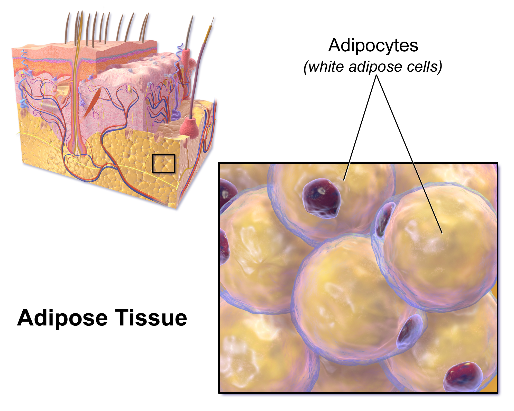

## Table of Contents

<!-- MarkdownTOC autolink="true" levels="1,2" -->

- [Introduction](#introduction)
- [Dataset description](#dataset-description)
    - [Data provenance: the GTEx database](#data-provenance-the-gtex-database)
    - [Dataset description](#dataset-description-1)
- [What you will learn from the analysis of dataset #1](#what-you-will-learn-from-the-analysis-of-dataset-1)
- [Credits](#credits)
    - [Dataset](#dataset)
    - [Teaching materials](#teaching-materials)
    - [Image credits](#image-credits)

<!-- /MarkdownTOC -->

# Introduction 

Using a dataset on human gene expression, we are going to search for gene markers related to the subcutaneous fat adipose tissue.

Taken from [Wikipedia](https://en.wikipedia.org/wiki/Adipose_tissue#Subcutaneous_fat):
> Most of the remaining nonvisceral fat is found just below the skin in a region called the hypodermis.This subcutaneous fat is not related to many of the classic obesity-related pathologies, such as heart disease, cancer, and stroke, and some evidence even suggests it might be protective. The typically female (or gynecoid) pattern of body fat distribution around the hips, thighs, and buttocks is subcutaneous fat, and therefore poses less of a health risk compared to visceral fat.

<figure>
  
  <figcaption></figcaption>
</figure> 

> ## Objective of this first section of the lesson
> The goal of this first section is to find __subcutaneous fat adipose-related gene markers__ using existing gene expression data. 
{: .callout}

 

# Dataset description

## Data provenance: the GTEx database

The dataset that you will use comes from the [Genotype-Tissue Expression (GTEx) project](https://www.gtexportal.org/home/). This portal gathers comprehensive public resources to study __tissue-specific gene expression__. Samples were collected from 54 non-diseased tissue sites across nearly 1000 individuals. 
The GTEx Portal provides open access to the dataset and includes numerous extra information (e.g. QTLs, etc.).

This database is useful to find gene markers for a specific tissue. In turn, it can be used to find tissue-specific genes and pathways, etc. 

## Dataset description

You will work on a RNA-seq dataset from the GTEx database version 7 (June 30, 2017). This dataset comprises 56,202 genes from 53 different human tissues.  

 

# What you will learn from the analysis of dataset #1

1. **How to perform Exploratory Data Analysis steps** 
    - Showing the first records of a dataset.
    - Checking if data types (strings, numbers) are correctly encoded.
    - Creating a few plots to reveal potential data issues (scale, outliers, etc.).
2. **How to create and interpret a Principal Component Analysis**
    - Performing the PCA: number of components, extract scores and loadings.
    - Creating the PCA plot, choosing scaling and centering.
    - Extracting the genes most related to the principal components of interest.
3. **How to perform a clustering analysis and coupling it to a heatmap representation**
    - Understand the distance metric used for clustering. 
    - Choosing one clustering method.
    - Creating heatmaps and re-using the clustering performed previously.

 

# Credits

## Dataset
The original RNA-seq dataset used is called _GTEx_Analysis_2016-01-15_v7_RNASeQCv1.1.8_gene_median_tpm.gct.gz_ and comes from the GTEx portal [link to dataset](https://storage.googleapis.com/gtex_analysis_v7/rna_seq_data/GTEx_Analysis_2016-01-15_v7_RNASeQCv1.1.8_gene_median_tpm.gct.gz). This dataset is pre-processed as gene TPM medians per tissue are already computed. 

It is used in the original publication from Ahn et al. 2019 that is used as a roadmap:     
Ahn, J., Wu, H. & Lee, K. Integrative Analysis Revealing Human Adipose-Specific Genes and Consolidating Obesity Loci. Sci Rep 9, 3087 (2019). [Link](https://doi.org/10.1038/s41598-019-39582-8). 

## Teaching materials
This lesson has been formatted according to the [Carpentries Foundation](https://carpentries.org/) lesson template and following their recommendations on how to teach researchers good practices in programming and data analysis.   

This material builds from a lot of fantastic materials developed by others in the open data science community. Most of the content derives from the [Harvard Chan Bioinformatics Core](https://github.com/hbctraining) which are greatly acknowledge for the quality of their teaching materials.

## Image credits
* Adipose tissue: Blausen.com staff (2014). "Medical gallery of Blausen Medical 2014". WikiJournal of Medicine 1 (2). [DOI:10.15347/wjm/2014.010](DOI:10.15347/wjm/2014.010). ISSN 2002-4436.


