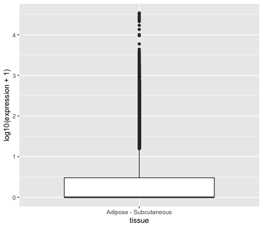
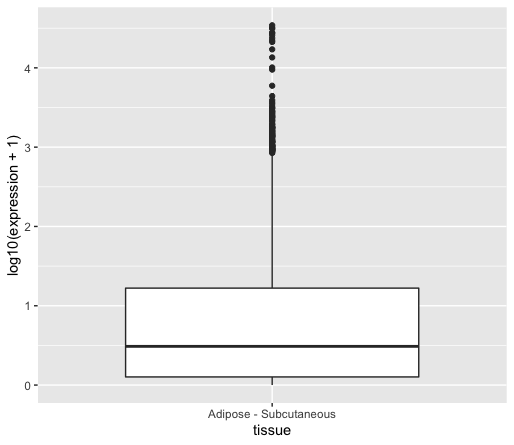
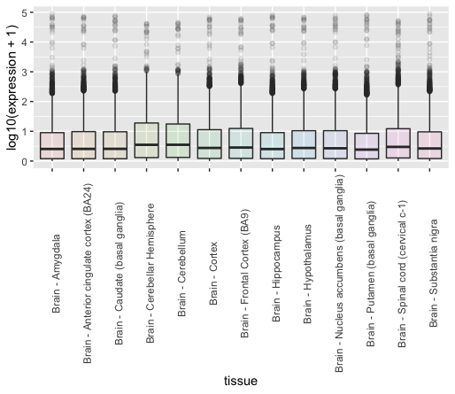
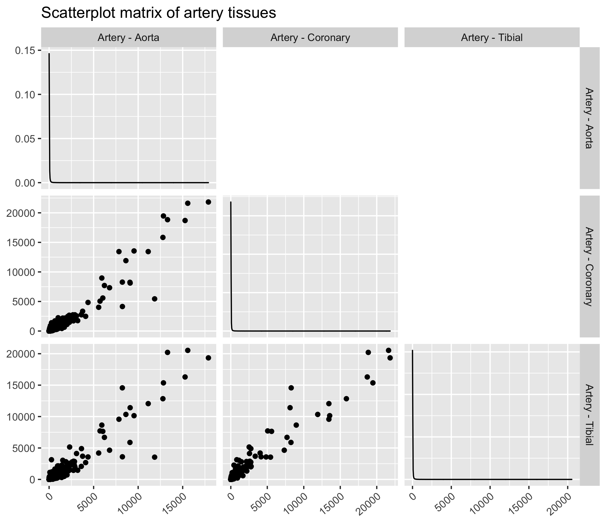
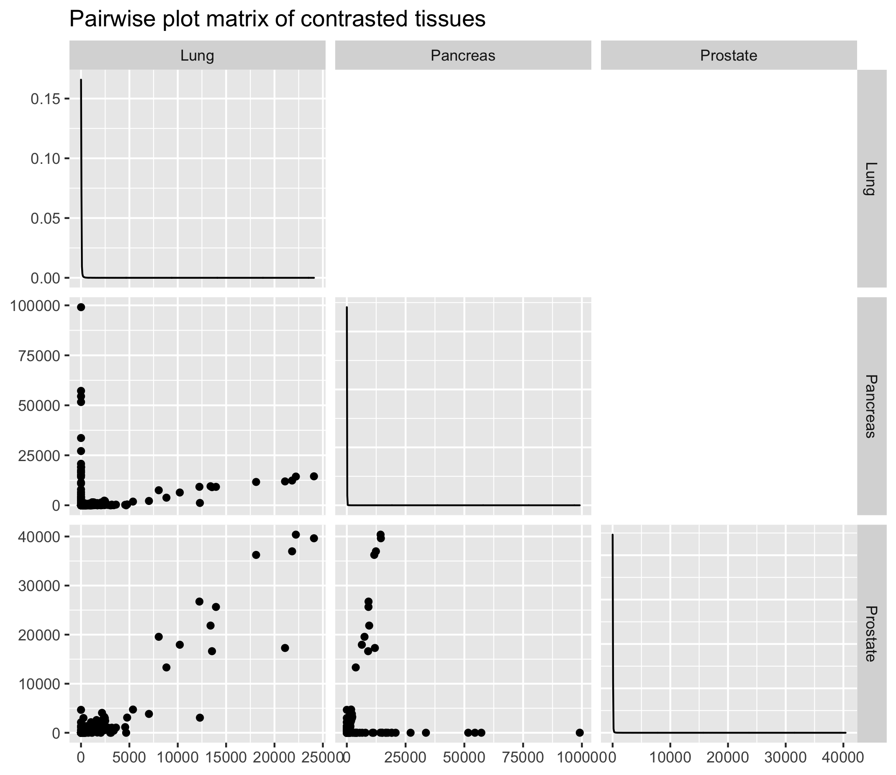

# Table of Contents
<!-- MarkdownTOC autolink="true" levels="1,2" -->

- [1. What is Exploratory Data Analysis?](#1-what-is-exploratory-data-analysis)
- [2. Data import sanity checks](#2-data-import-sanity-checks)
- [3. Data exploration](#3-data-exploration)
  - [3.1 Simple statistical metrics](#31-simple-statistical-metrics)
  - [3.2 Simple graphical descriptions](#32-simple-graphical-descriptions)
- [4. Describing relationships between the different variables](#4-describing-relationships-between-the-different-variables)
  - [4.1 Similar tissues \(artery\)](#41-similar-tissues-artery)
  - [4.2 Dissimilar tissues \(lung, prostate and pancreas\)](#42-dissimilar-tissues-lung-prostate-and-pancreas)
- [References](#references)

<!-- /MarkdownTOC -->

# 1. What is Exploratory Data Analysis?
EDA (short for Exploratory Data Analysis) can have different purposes:
* Handle Missing values.
* Removing duplicates.
* Outlier Treatment.
* Normalizing and Scaling( Numerical Variables).
* Encoding Categorical variables( Dummy Variables).
* Bivariate Analysis.

Here, we are not going to do all of this. Instead, we will perform some data import checks, plotting some statistics and get an idea of how each tissue relates to each other. 

# 2. Data import sanity checks

First, create a `data/` folder in your working directory. For instance, if you are working on your Desktop, then your R working directory should be `~/Desktop/` at the top of your R console (bottom-left panel).

You can also check this within R using the `getwd()` command. 

~~~
getwd()
~~~
{: .language-r}

~~~
# download the file from Zenodo
download.file(url = "https://zenodo.org/record/4068261/files/GTEx_Analysis_2016-01-15_v7_RNASeQCv1.1.8_gene_median_tpm.tsv?download=1", 
              destfile = "data/test.tsv", method = "wget", quiet = TRUE)

df_expr <- read.delim(file = "data/GTEx_Analysis_2016-01-15_v7_RNASeQCv1.1.8_gene_median_tpm.tsv", 
                 header = TRUE, 
                 stringsAsFactors = FALSE,
                 check.names = FALSE)
~~~
{: .language-r}

You can already check the number of rows (genes) and columns (tissues/samples) using simple R functions:

~~~
# number of rows / columns
nrow(df_expr)
ncol(df_expr)
~~~
{: .language-r}

This should give you __56,202 genes__ (probes) and __53 tissues__ (55 -2 columns: gene id and description). 

How did R "understand" your different data types? 
~~~
glimpse(df)
~~~
{: .language-r}

This command will output this in your console:
~~~
Rows: 56,202
Columns: 55
$ gene_id                                     <chr> "ENSG00000223972.4", "ENSG00000227232.4", "ENSG00000243…
$ Description                                 <chr> "DDX11L1", "WASH7P", "MIR1302-11", "FAM138A", "OR4G4P",…
$ `Adipose - Subcutaneous`                    <dbl> 0.056945, 11.850000, 0.061460, 0.038600, 0.035695, 0.04…
$ `Adipose - Visceral (Omentum)`              <dbl> 0.05054, 9.75300, 0.05959, 0.03245, 0.00000, 0.03988, 0…
$ `Adrenal Gland`                             <dbl> 0.074600, 8.023000, 0.081790, 0.040500, 0.034790, 0.049…
$ `Artery - Aorta`                            <dbl> 0.03976, 12.51000, 0.04297, 0.02815, 0.00000, 0.03399, …
$ `Artery - Coronary`                         <dbl> 0.04386, 12.30000, 0.05848, 0.03678, 0.00000, 0.00000, …
$ `Artery - Tibial`                           <dbl> 0.04977, 11.59000, 0.05184, 0.03894, 0.00000, 0.04286, …
...(more lines)
~~~
{: .output}

> ## Question
> 1. Did R convert the "gene_id" column to a suitable data type?
> 2. Did R convert all the other columns to a suitable data type?
>
> > ## Solution
> > 1. Yes, R has converted the "probe" column into the `chr` data type which stands for character. This is because we specify `stringsAsFactors = FALSE` in the 
> > `read.csv()` function at the beginning. 
> > 2. Yes, all tissue columns with gene expression measurements have been converted to the `dbl` data type which stands for "double class" (a double-precision floating point number). In short, it is a number with decimals. 
> {: .solution}
{: .challenge}

~~~
head(n = 5)
~~~
{: .language-r}

For big matrix, do `df_expr[1:5,1:5]` to show the first five lines and five columns for instance. 

# 3. Data exploration 

## 3.1 Simple statistical metrics

EDA helps to get a better understanding of the studied dataset and preparing its downstream analysis (e.g. fitting a regression model). 
We are first going to compute a few descriptive metrics followed by some plotting. 

> ## Question
> Calculate a series of descriptive metrics on the expression value for all tissues: 
  - minimumn 
   - maximum 
   - average 
   - median  
>  
> Hint: make your dataset tidy first and use the `%>%` operator to chain operations on your dataframe. 
>
> > ## Solution
> > ~~~
> > df_expr %>% 
> >   pivot_longer(cols = - c(gene_id, Description), 
> >                names_to = "tissue", 
> >                values_to = "expression") %>% 
> >   summarise(max = max(expression), 
> >             min = min(expression), 
> >             average = mean(expression), 
> >             median = median(expression)
> >             )
> > ~~~~
> > {: .language-r}
> > 
> > This gives you the following results:
> > ~~~~
> > # A tibble: 1 x 4
> >      max   min average median
> >    <dbl> <dbl>   <dbl>  <dbl>
> >  246600  0    16.6    0.00490
> >~~ 
> > {: .output}
> {: .solution}
{: .challenge}

> ## Discussion
> 1. What do these gene expression metrics tell you about the spread of data? 
> 2. Do you think it can have an influence on data representation? If yes, what sort of bias can it introduce?
> 
> > ## Solution
> > 1. As the maximum value is equal to 246600 and the minimum to 0, these data are heavily spread on several orders of magnitude.
> > 2. Since you will have to represent gene expression values using a common scale, it might be difficult to represent both low and very high expression values. One solution is to scale data or to use a transformation e.g. $$log_{10}$$. 
> {: .solution}
{: .challenge}

## 3.2 Simple graphical descriptions

### One tissue

Since a picture is worth a thousand word, we can generate a few plots to describe our gene expression values, in particular in a tissue-specific way.

First, we need to make our dataframe tidy and save it under a new name (`df_tidy`). Let's do it like this:

~~~
df_tidy <- df_expr %>% 
  pivot_longer(cols = - c(gene_id, Description), 
               names_to = "tissue", 
               values_to = "expression") 
~~~
{: .language-r}

Let's start simple! Let's plot the distribution of gene expression values from _one_ tissue as a boxplot. A [boxplot](https://en.wikipedia.org/wiki/Box_plot) shows the distribution of continuous values, its four quartiles and possible outliers:

* __Minimum :__ the lowest data point excluding any outliers.
* __Maximum :__ the largest data point excluding any outliers.
* __Median (Q2 / 50th percentile) :__ the middle value of the dataset.
* __First quartile (Q1 / 25th percentile) :__ also known as the lower quartile qn(0.25), is the median of the lower half of the dataset.
* __Third quartile (Q3 / 75th percentile) :__ also known as the upper quartile qn(0.75), is the median of the upper half of the dataset.

~~~
df_tidy %>% 
  dplyr::filter(tissue == "Adipose - Subcutaneous") %>% # the dplyr:: notation makes sure the filter function comes from the dplyr package
  ggplot(data = ., aes(x = tissue, y = expression)) +
    geom_boxplot()
~~~
{: .language-r}

This will give you the following plot:

As you can see, we can retrieve the issue of displaying highly expressed genes together with lowly expressed genes. 

> ## Question
> Within `ggplot`, find a way to show both low and high gene expression values altogether. 
> Hint: log10 transform the `y` variable in `aes()`.
> > ## Solution
> > ~~~
> > df_tidy %>% 
> >   dplyr::filter(tissue == "Adipose - Subcutaneous") %>%   # the dplyr:: notation makes sure the filter function comes from dplyr
> >   ggplot(data = ., aes(x = tissue, y = log10(expression + 1)) + #  add 1 to the values to avoid -Inf when using $$log_{10}$$ transformation
> >     geom_boxplot() 
> > ~~~ 
> > {: .language-r}
> {: .solution}
{: .challenge}

You could also remove the gene values equal to 0 by adding a `dplyr::filter(expression != 0)` line before the `ggplot()` call.

You can see that the median is now visible since further away from zero. 

### Multiple tissues

Let's now see how these different samples compare to each other in terms of tissue expression.   
Instead of plotting all tissues, let's plot all brain tissues using a `filter` function call.

~~~
df_tidy %>%
  dplyr::filter(expression != 0) %>% 
  filter(grepl(pattern = "Brain*", x = tissue)) %>% 
  ggplot(data = ., aes(x = tissue, y = log10(expression + 1), fill = tissue)) + 
    geom_boxplot(alpha = 0.1) + 
    theme(axis.text.x = element_text(angle = 90)) +
    guides(fill=FALSE) 
~~~
{: .language-r}

> ## Discussion
> Try to plot all tissues and not only brain tissues, what issue do you see? 
{: .discussion}

While boxplots are useful to display a few key metrics, it is hard to compare tissues to each other. Instead, we can overlay distributions on top of each others to identify potential deviant tissues.

~~~
df_tidy %>% 
  mutate(log_expression = log10(expression)) %>%     # another way to log-transform your data before plotting 
  ggplot(data = ., aes(x = log_expression, fill = tissue)) + 
    geom_density(alpha = 0.1) + 
    theme(axis.text.x = element_text(angle = 90)) +
    guides(fill=FALSE)
~~~
{: .language-r} 

# 4. Describing relationships between the different variables

A great way to visualise similar patterns from high-dimensional data is to create so-called _pairwise plot matrix_ to compare all tissues to each other in a comprehensive way. 
Since we have 53 tissues, we could plot a 53 x 53 matrix but this requires some computational time. Instead, we are going to visualise similar and dissimilar tissues 3 tissues at a time (3 x 3 pairwise plot matrix).  

## 4.1 Similar tissues (artery)

Similar tissues exhibit comparable gene expression patterns as it can be seen from the figure below. Here we will use the `ggpairs` function from the [`GGally` ggplot extension](https://www.rdocumentation.org/packages/GGally/versions/1.5.0). In order to use `ggpairs`, we will have to make the dataframe "wide" again using `pivot_wider()` for the `ggpairs` function to work.  

Also, we will filter tissues based on a regular expression (`Artery*`) so that only tissue names with "artery" in their name are kept. 
~~~
df_tidy %>%
  dplyr::filter(expression != 0) %>% 
  filter(grepl(pattern = "Artery*", x = tissue)) %>% 
  pivot_wider(id_cols = c(gene_id, Description), names_from = tissue, values_from = expression) %>% 
  dplyr::select(- gene_id, - Description) %>%  # as ggpairs only accept numerical values
  ggpairs(title = "Scatterplot matrix of artery tissues", upper = "blank") +
  theme(axis.text.x = element_text(angle = 40, hjust = 1, vjust = 1))
~~~
{: .language-r}

> ## Exercise
> Try to plot other tissue types based on a regular expression. You can try "Esophagus\*" or "Brain\*" for instance. 
{: .challenge} 

## 4.2 Dissimilar tissues (lung, prostate and pancreas)

On the contrary, some tissues will exhibit contrasted gene expression profiles. Let's try with tissues that intuitively should be different i.e. the lungs, prostate and pancreas. 

# References 

