# Table of Contents

<!-- MarkdownTOC autolink="True" levels="1,2,3" -->

- [1. Principal Component Analysis](#1-principal-component-analysis)
  - [1.1 Introduction to PCA](#11-introduction-to-pca)
  - [1.2 The Iris dataset](#12-the-iris-dataset)
- [2. PCA analysis on dataset #1](#2-pca-analysis-on-dataset-1)
  - [2.1 Data filtering and transformation](#21-data-filtering-and-transformation)
  - [2.2 Performing the PCA analysis](#22-performing-the-pca-analysis)
  - [2.3 Number of components to extract: the scree plot](#23-number-of-components-to-extract-the-scree-plot)
  - [2.4 PCA score plot](#24-pca-score-plot)
  - [2.5 Genes most related to PCs](#25-genes-most-related-to-pcs)
  - [2.6 PCA loading plot](#26-pca-loading-plot)
- [3. Time to practice](#3-time-to-practice)
- [4. References](#4-references)

<!-- /MarkdownTOC -->

# 1. Principal Component Analysis

## 1.1 Introduction to PCA
In (bio)chemical analysis the data matrices can be very large. An infrared spectrum (800 wavelengths) for 50 samples for example would give a data matrix of size 40,000 (50x800) numbers.  A genomic data (e.g. 20,000 genes) for 100 patients would lead to a huge data matrix of (100x20,000) = 2,000,000 numbers. 

These matrices are so large that we need convenient ways to extract the important information from these large data matrices. 

Using principal component analysis (PCA) 

- The data is reduced to smaller matrices so they can more easily be examined, plotted and interpreted.
- The most important factors are extracted (principal components). These factors describe the multivariate (more than one variable) interactions between the measured variables.
- The samples can be classified to identify compound spectra, determine biomarkers etc.

To have an idea of how PCA works it should be noted that if there is a mutual relationship between two or more measurements (e.g. samples) they are correlated. These correlations can be strong (e.g. mass of object and weight on earth's surface) or weak (e.g. capabilities in sport and month of birth). In the example below there is a strong linear relationship between height and age for young children (*Moore, D.S. and McCabe G.P., Introduction to the Practice of Statistics (1989)*).

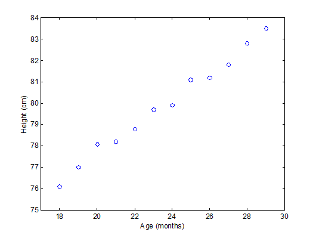

To explain PCA we use the example above and **project** the cases (observations) on a new coordinate system defined by principal component 1 (PC1) and principal component 2 (PC2) .

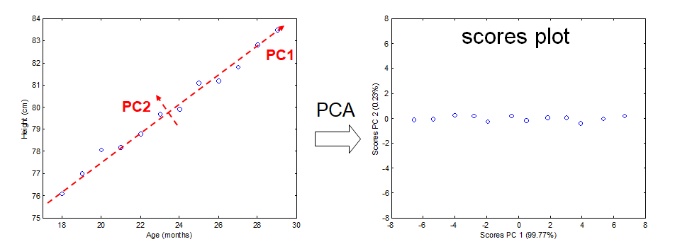

In this new coordinate system, PC1 explains 99.77% of the total variation of the original data set while PC2 only explains 0.23%. Consequently, only variable (PC1) is sufficient to describe the whole data set which would support the conclusion that there is only 1 underlying factor, in this case age.

If the original data has more than two variables (e.g. n), which usually is the case, the projection would be in the n-dimensional space. Consequently more than two principal components can be calculated. By using an optimal projection, the principal components describe the maximum variance and are calculated in order of importance e.g.

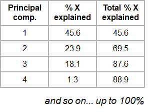

## 1.2 The Iris dataset

​The ability of PCA to capture as much variance as possible in the main principal components enables us to  to visualize (and summarize) the relation between objects (and variables) from a multi-dimensional space to a two dimensional plot.  

We can use the Fisher's famous Iris flower dataset from 1936 that describes three species of Iris (_Iris setosa_, _Iris virginica_ and _Iris versicolor_). The data set consists of 50 samples from each of these three species of Iris. Four features were measured from each sample: the length and the width of the sepals and petals, in centimeters ([source Wikipedia](https://en.wikipedia.org/wiki/Iris_flower_data_set)). See some pictures below.

| _Iris setosa_                                     | _Iris versicolor_                                  | _Iris virginica_                                        |
|---------------------------------------------------|----------------------------------------------------|---------------------------------------------------------|
|  |  | |

In the example below there is clear separation of the three types of [flowers](https://en.wikipedia.org/wiki/Iris_flower_data_set) which points to shared interactions between the different variables per group. 

To load this data in R  first the appropriate dataset have to be installed and loaded.
~~~
library(datasets)
data(iris)
head(iris)
~~~
{: .language-r}

~~~
Sepal.Length Sepal.Width Petal.Length Petal.Width Species
1          5.1         3.5          1.4         0.2  setosa
2          4.9         3.0          1.4         0.2  setosa
3          4.7         3.2          1.3         0.2  setosa
4          4.6         3.1          1.5         0.2  setosa
5          5.0         3.6          1.4         0.2  setosa
6          5.4         3.9          1.7         0.4  setosa
~~~
{: .output}

The summary of the iris data set display the content of the data. In this case the data consists of 150 objects with 5 variables. The last variable Species is a factor variable that specifies the class of the object.

~~~
 Sepal.Length    Sepal.Width     Petal.Length    Petal.Width          Species  
 Min.   :4.300   Min.   :2.000   Min.   :1.000   Min.   :0.100   setosa    :50  
 1st Qu.:5.100   1st Qu.:2.800   1st Qu.:1.600   1st Qu.:0.300   versicolor:50  
 Median :5.800   Median :3.000   Median :4.350   Median :1.300   virginica :50  
 Mean   :5.843   Mean   :3.057   Mean   :3.758   Mean   :1.199                  
 3rd Qu.:6.400   3rd Qu.:3.300   3rd Qu.:5.100   3rd Qu.:1.800                  
 Max.   :7.900   Max.   :4.400   Max.   :6.900   Max.   :2.500 
~~~
{: .output}

For convenience we use a very rudimentary (own) implementation implementation of PCA. Copy-paste this code into R to load this function into your environment and use it later on.

~~~
# define a custom R function called "mypca()""
mypca <- function(x, center = TRUE, scale = TRUE){  
  # Samples should be in rows
  # Variables in the columns
  
  # remove columns containing only 0 values
  # not informative + cause svd() error
  x_without_zero_columns <- x[,colSums(x != 0) != 0] 
  
  # perform SVD
  SVD <- svd(scale(x_without_zero_columns, center = center, scale = scale))
  
  # create scores data frame
  scores <- as.data.frame(SVD$u %*% diag(SVD$d))
  rownames(scores) <- rownames(x)
  colnames(scores) <- paste0("PC", c(1:dim(scores)[2]))
  
  # create loadings data frams
  loadings <- data.frame(SVD$v)
  colnames(loadings) <- paste0("PC", c(1:dim(loadings)[2]))
  row.names(loadings) <- colnames(x_without_zero_columns)
  
  # create data frame for explained variances
  explained_var <- as.data.frame(round((SVD$d^2) / sum(SVD$d^2)*100, digits = 1))
  rownames(explained_var) <- paste0("PC", c(1:dim(loadings)[2]))
  colnames(explained_var) <- "exp_var"
  
  # return result
  return (list("scores" = scores, "loadings" = loadings, "explained_var" = explained_var))
}
~~~
{: .language-r}

Now we have everything in our R environment into place, we can actually perform the PCA analysis and create the plots.  
Since the four first principal components catch most if not all 

~~~
# perform the PCA analysis on only the first 4 variables (skip the Species variable)
pca <- mypca(iris[,1:4], scale = FALSE)
scores = as.data.frame(pca$scores[,1:2])
scores['Species'] = iris$Species
explained_var = pca$explained_var$exp_var
~~~
{: .language-r}

In order to have an idea of how effective the 'compression' or variable reduction of the PCA algorithm was on our data set, we make a so-called 'scree' plot in which the explained variance is expressed as a function of the number of principal components.

~~~
# add a convenient column number for the bar plot to display
dfev <- data.frame(PC = c(1,2,3,4), exp_var  = pca$explained_var)

# make the plot
scree_plot <- ggplot(dfev, aes(x = PC, y = exp_var)) +
       ylab('explained variance (%)') + 
       ggtitle('explained variance per component') + 
       geom_bar(stat = "identity")

# display it
scree_plot
~~~
{: .language-r}

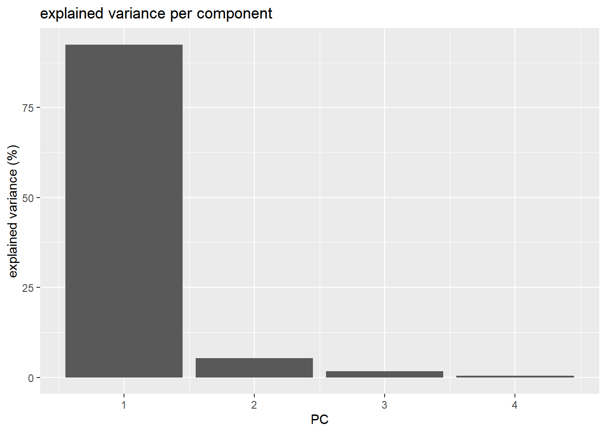

It is clear that the PCA really reduces our data to almost 1 variable (component) which explains over 90% of all the variance of the data. The second component only explains 5.3%. The third and fourth even less.

The whole idea behind the analysis is to visualize the high-dimensional data (e.g. a score plot) in a smaller dimensional space (e.g. 2D space). In R we can do that with the following lines of code

~~~
# plot the scores of the first 2 components
p <- ggplot(scores) + 
       geom_point(aes(x = PC1, y = PC2, shape = Species, col = Species)) + 
       xlab(paste0('PC1(',explained_var[1],'%)')) + 
       ylab(paste0('PC2(',explained_var[2],'%)')) + 
       ggtitle('PCA score plot')
p
~~~
{: .language-r}

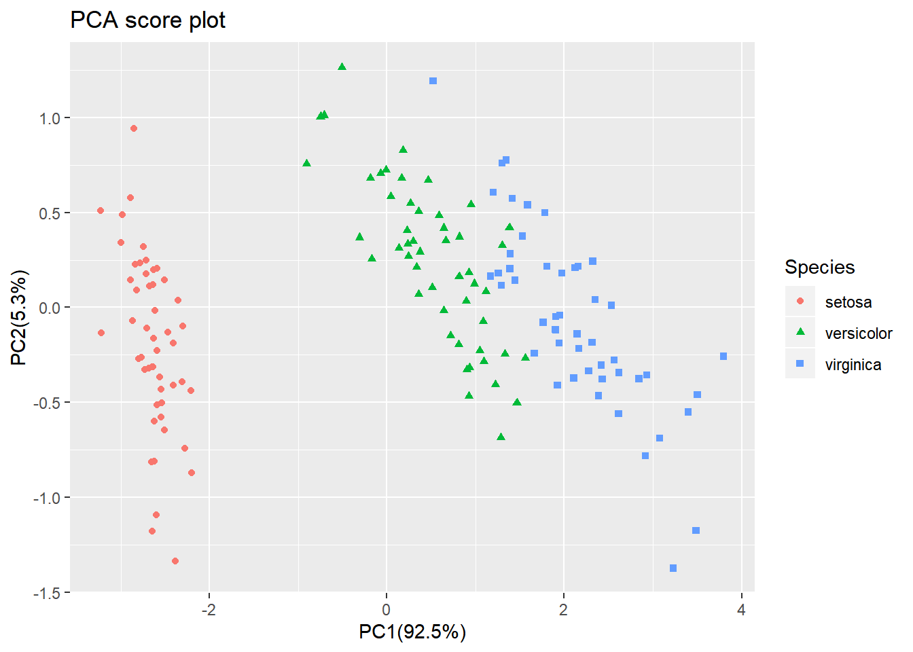

From the score plot it is clear that the Setosa flowers are different from the Versicolor/Virginica flowers. Versicolor and Virginica cannot be separated on PC1 and/or PC2.   

Looking at the PC1 vs PC3 however, the two groups can be separated better. It is very important to understand that even if a principal component explains a low amount of variance it still can contain interesting (biological) information. 

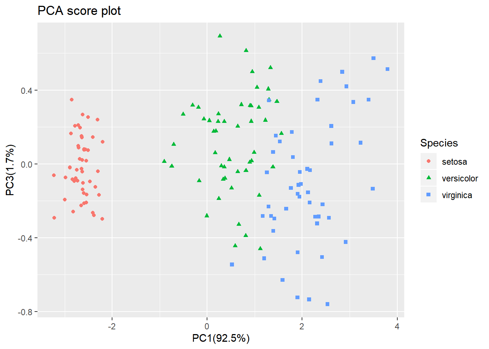

The scores are indicative of how the objects in the data set score in the new component space, correspondingly the loadings indicate how the variables score in the component space. The score plots above for example show a separation on PC1 between the 3 groups. If we would like to know which variables are important for this separation we can try to interpret our data.

~~~
library(reshape2) # to access the melt() function

# reformat the loading data
loadings <- melt(pca$loadings)
# rename the columns
colnames(loadings)<-c("Component","Value")
# add the 'original' variable names
loadings['Variable']=as.factor(rep(colnames(iris)[-5],4))
# plot the loading values per components
p <- ggplot(loadings,aes(x=Variable,y=Value)) +  geom_bar(stat='identity') + facet_wrap(~Component)
p
~~~
{: .language-r}

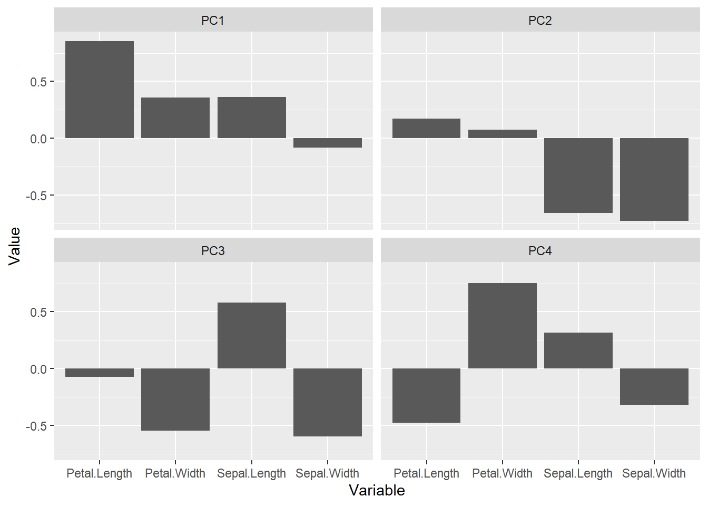

From the loading plot for PC1 it is clear that `Petal.Length` is the most important factor while `Sepal.Width` is the one which is least important. Because PC1 explains 92.5 % of the total variance we can conclude that `Petal.Length` is the most important factor that separates the three groups of flowers.   
There are many more things to learn on PCA (e.g. scaling, filtering) but that is out of the scope of these exercises. 

  

# 2. PCA analysis on dataset #1

For the rest of the lesson, we are going to filter our gene expression dataset to retain only 10 tissues to simplify the analysis. This will not change your main goal (e.g. find subcutaneous fat adipose-related genes). 

Performing a PCA will tell us whether some structure is present in our tissue expression dataset. It is often a sanity check to see how our experimental design is related to variation in the data. 

## 2.1 Data filtering and transformation

Let's first import the gene expression dataset and filter it. 
~~~
df_expr <- read.delim(file = "data/GTEx_Analysis_2016-01-15_v7_RNASeQCv1.1.8_gene_median_tpm.tsv", 
                 header = TRUE, 
                 stringsAsFactors = FALSE,
                 check.names = FALSE)

df_expr_ten_tissues = 
  dplyr::select(df_expr, - Description) %>% 
  dplyr::select(1:11) # 'gene_id' column and 10 other tissues

df_expr_ten_tissues[1:5,1:5]
~~~
{: .language-r}

Genes are in rows while tissues are in columns.   
~~~
gene_id           `Adipose - Subcutaneous` `Adipose - Visceral (Omentum… `Adrenal Gland` `Artery - Aorta`
  <chr>                                <dbl>                         <dbl>           <dbl>            <dbl>
1 ENSG00000223972.4                   0.0569                        0.0505          0.0746           0.0398
2 ENSG00000227232.4                  11.8                           9.75            8.02            12.5   
3 ENSG00000243485.2                   0.0615                        0.0596          0.0818           0.0430
4 ENSG00000237613.2                   0.0386                        0.0324          0.0405           0.0282
5 ENSG00000268020.2                   0.0357                        0               0.0348           0     
~~~
{: .output}

It is a common convention that genes (variables) are in columns and tissues (samples) are in rows. Therefore, we will need to transpose the data first before performing the PCA analysis.

~~~
# It's usually a convention to have variables in columns and samples in rows.
# Here: Genes = variables 
# Here: Tissues = samples
# PCA: scores will be computed for samples/tissues and will give us their coordinates
# while loadings will be related to variables (genes)
# We need to transpose our dataset so that rows/columns are inverted
df_expr_transposed <- df_expr_ten_tissues %>% 
   column_to_rownames("gene_id") %>% 
  t()

df_expr_transposed[1:5,1:4]
~~~ 
{: .language-r}

Genes are now in columns and tissues in rows.
~~~
                             ENSG00000223972.4 ENSG00000227232.4 ENSG00000243485.2 ENSG00000237613.2
Adipose - Subcutaneous                0.056945            11.850           0.06146           0.03860
Adipose - Visceral (Omentum)          0.050540             9.753           0.05959           0.03245
Adrenal Gland                         0.074600             8.023           0.08179           0.04050
Artery - Aorta                        0.039760            12.510           0.04297           0.02815
Artery - Coronary                     0.043860            12.300           0.05848           0.03678
~~~
{: .output}

We are now ready to actually perform the PCA itself.

## 2.2 Performing the PCA analysis

Let's create an object called `pca` that contains all the PCA information required later for plots. The `mypca()` function is the custom function we used before (see above).

~~~
pca <- mypca(x = df_expr_transposed, 
            center = TRUE, 
            scale = TRUE)
~~~
{: .language-r}

Please not that centering and scaling are set using the `center = TRUE` and `scale = TRUE` arguments.   

## 2.3 Number of components to extract: the scree plot

A scree plot is useful to determine the number of principal components to retain in further downstream analysis. That is "how many components are sufficient to catch most of the variation within the data". 

A scree plot displays the explained variance (in %) as a factor of the number of PCs in the form of a downward curve. if an "elbow" can be seen on the curve with a flat line afterwards, you can retain the number of PCs that is indicated by the "elbow".

> ## Maximum number of Principal Components
> Mathematically, the maximum number of PCs that can be built is equal to the matrix rank (number of linearly independent columns of a matrix). In practice, this is equal to the minimum of the number of rows and columns.   
{: .callout}

In our example, our `df_expr_transposed` dataset has 10 rows (tissues) and 56,202 columns (genes): therefore, we can at best build 10 PCs.  
The first PC should account for the largest possible variance in the data set, the second for the second largest, etc.

~~~
# Create a dataframe with all PC components (n = number of tissues)
exp_var_df <- data.frame(PC = seq(1:nrow(pca$explained_var)), exp_var = pca$explained_var)

# make the complete screeplot
ggplot(exp_var_df, aes(x = PC, y = exp_var, label = PC)) +
  ylab('explained variance (%)') + 
  ggtitle('explained variance per component (all principal components') + 
  geom_bar(stat = "identity") +
  labs(x = "Principal Component number") + 
  scale_y_continuous(limits = c(0, 50)) +
  scale_x_continuous(breaks = seq(from = 1, to = 10, by = 1))
~~~
{: .language-r}

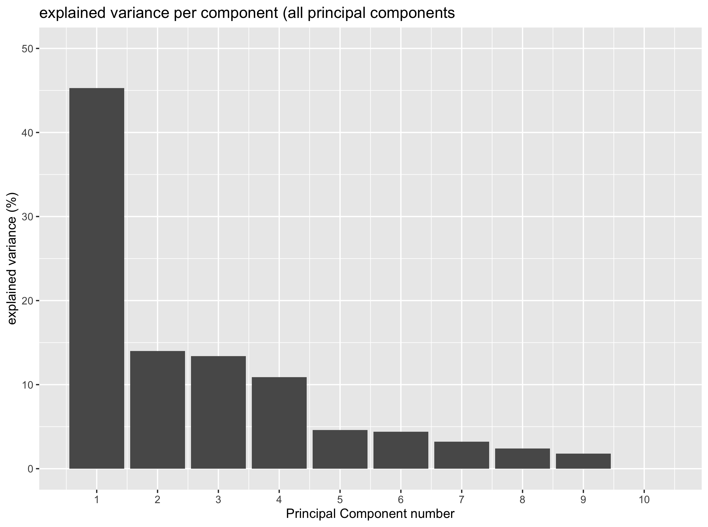

> ## Exercise
> Based on the last plot, how many PCs do you think are necessary to catch most of the variation in the data?
> > ## Solution
> > One component would be enough to catch around 45% of the total variance. Yet PC2, PC3 and PC4 also explain some variation (around 10%) and could be worthwhile to keep.
> {: .solution}
{: .challenge }

The scree plot above clearly shows that one principal component manages to catch up around 45% of the total variance. Whether this is related to our different tissues remains to be seen. Yet, you can also see that PC2, PC3 and PC4 also explain around 10% of the total variance therefore suggesting that they may also comprise relevant (biological) information. 

We will see how a _score plot_ can help to determine how PCs are related to our tissues in the new coordinate system.

> ## Callout
> There is another way to determine the number of PC. Instead of looking for an "elbow" (inflexion point) in the scree plot, one chooses the percentage of variance to be explained in advance and determines how many PCs are necessary and sufficient to explain this percentage of variance.  
{: .callout} 

Let's practice this alternative method.

> ## Exercise
> Assuming that you want to explain 80% of the variance, how many PCs would you need?
> 1. Knowing that the `cumsum()` function can be used to calculate a cumulative sum, add a column to the `exp_var_df` that contains the cumulative variance explained by PC1, PC2, etc.
> 2. Make a plot using `ggplot()` that displays the cumulative variance explained by the different PCs. Add a horizontal line that shows the 80% variance threshold. 
> 3. Automatically extract the number of PCs sufficient to explain 80% of the total variance. 
> 
> > ## Solution
> > 1) Using the `cumsum` function:  
> > ~~~
> > exp_var_df = mutate(exp_var_df, cum_var = cumsum(exp_var))
> > ~~~
> > {: .language-r}
> > 
> > 2) Here is a solution:    
> > ~~~
> > ggplot(exp_var_df, aes(x = PC, y = cum_var)) +
> >   geom_point() + 
> >   geom_line(group = 1) + 
> >   labs(x = "Principal Component", y = "Cumulative Explained Variance (%)") +
> >   scale_x_continuous(breaks = 1:10) +
> >   geom_hline(yintercept = 80, color = "red")
> > ~~~
> > {: .language-r}
> > 
> > 3) You have to retrieve the PC for which the cumulative variance becomes higher than the 80% threshold. Here, you have to have 4 PCs to explain more than 80% of the variance.  
> > ~~~
> > # this gives you all the PCs for which the cumulative explained variance is above 80%
> > exp_var_df[which(exp_var_df$cum_var > 80),]
> > 
> > # adding min() before this expression gives you the first row where it happens. 
> > exp_var_df[min(which(exp_var_df$cum_var > 80)),]
> > ~~~
> > {: .language-r}
> > 
> {: .solution}
{: .challenge }

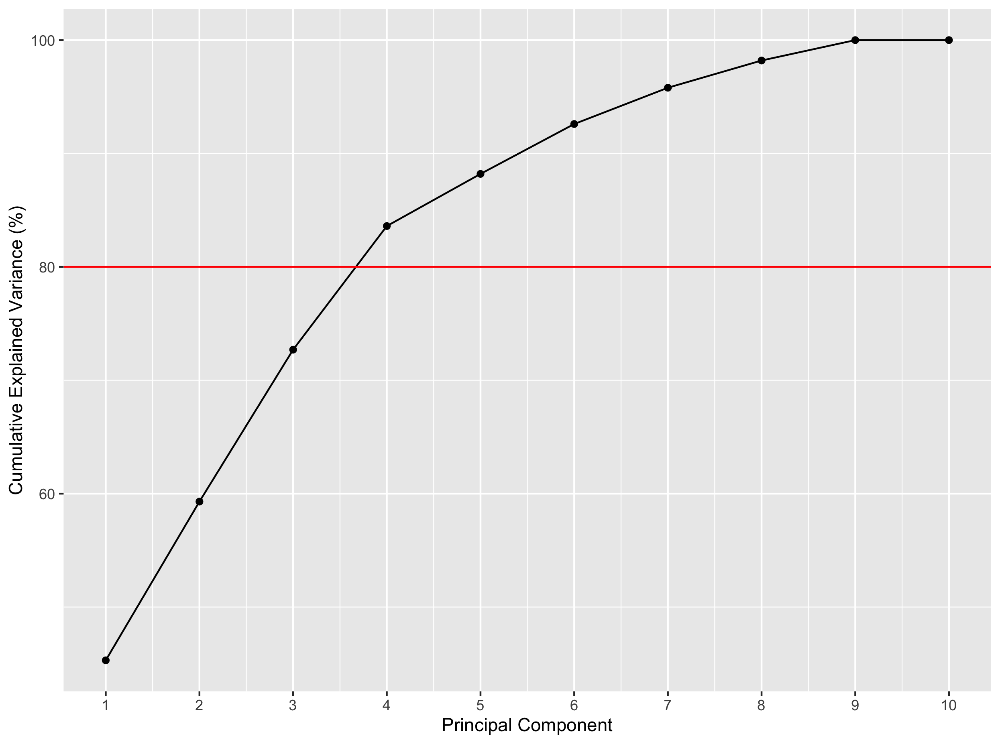

4 principal components would be enough to explain more than 80% of the variance here. 

## 2.4 PCA score plot

The score plot will indicate where our tissues (samples) are in our new coordinate system based on the computed PCs. 

Let's first create a dataframe containing the gene scores in the new dimensional space created by the computed PCs.  
~~~
scores <- pca$scores
scores[1:5,1:5]
~~~
{: .language-r} 

~~~
                                    PC1        PC2        PC3        PC4        PC5
Adipose - Subcutaneous       -90.225250   5.057291 -69.535176   81.98662 -16.812756
Adipose - Visceral (Omentum) -55.218949  12.039811 -91.344836   74.09467  11.613831
Adrenal Gland                 -3.650495  98.064591 -85.036562 -125.37325  -3.532067
Artery - Aorta               -91.912081 -82.419671  30.384563  -43.57703  17.923121
Artery - Coronary            -79.536045 -48.810424   3.865236  -15.59008  10.612863
~~~
{: .output}

You see that each tissue has specific coordinates on each PC ("axis") of the new dimensional space. That means that we can display these points as a 2D plot using two PCs at a time.  
 
Let's do this with PC1 and PC2. 

~~~
library("ggrepel")

# extract explained variance to add to the axis labels
explained_var = pca$explained_var$exp_var

# useful for labelling the dots in the plot 
tissue_names = row.names(scores)

ggplot(scores, aes(x = PC1, y = PC2, label = tissue_names)) + 
  geom_point(aes(colour = factor(tissue_names))) + 
  xlab(paste0('PC1 (',explained_var[1],'%)')) + 
  ylab(paste0('PC2 (',explained_var[2],'%)')) + 
  ggtitle('PCA score plot') + 
  geom_text_repel() +
  guides(colour = FALSE) # remove the color legend (not informative)
~~~
{: .language-r}

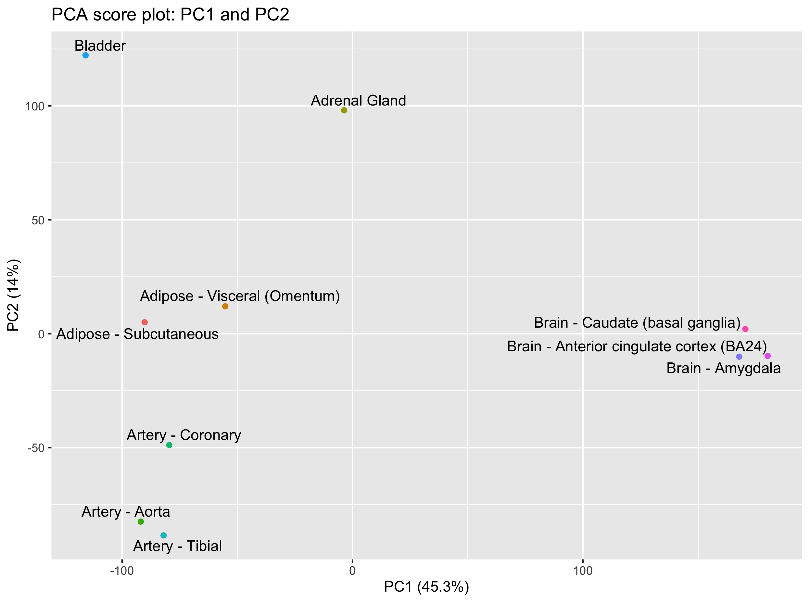

We do see some groupings among our tissues. In particular, it is quite clear that _brain_ tissues distinguish themselves based on PC1 while the _bladder_ and _adrenal gland_ are separated from the other tissues on PC2. 

> ## Question
> Can you create the score plot for PC2 and PC3?   
> What are the tissues that you can separate on PC3?  
> Hint: keep PC2 on the y axis so that you keep one common axis with the previous plot (PC1-PC2 plot).
> 
> > ## Solution
> > ~~~
> > ggplot(scores, aes(x = PC3, y = PC2, label = tissue_names)) + 
> >  geom_point(aes(colour = factor(tissue_names))) + 
> >   xlab(paste0('PC3 (',explained_var[3],'%)')) + 
> >   ylab(paste0('PC2 (',explained_var[2],'%)')) + 
> >   ggtitle('PCA score plot: PC2 and PC3') + 
> >   geom_text_repel() +
> >   guides(colour = FALSE)
> > ~~~
> > {: .language-r}  
> > This PC2-PC3 score plot shows that the _bladder_ and _adrenal gland_ can now be separated on PC3.  
> {: .solution}
{: .challenge}

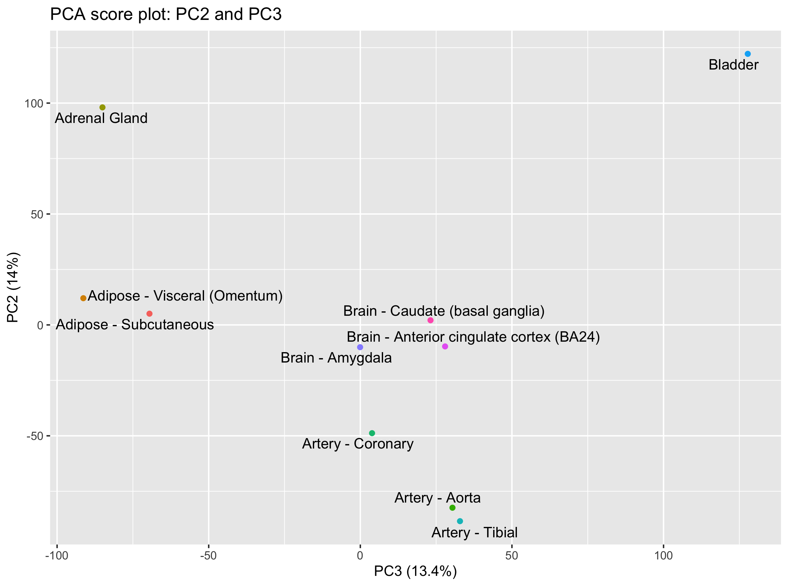

## 2.5 Genes most related to PCs

Since the principal components are built using weighted combinations of the initial variables (genes here), it is possible to retrieve these variable coefficients that are called "loadings".

A high loading for one gene on a given PC indicates that this gene has a high contribution to the construction of the given PC.

Let's extract the 10 genes with the highest contribution to PC1, PC2 and PC3 for instance. 

~~~
loadings <- pca$loadings %>%
  rownames_to_column("gene_id") 

loadings[1:5,1:5]
~~~
{: .language-r}

~~~
            gene_id          PC1           PC2           PC3           PC4
1 ENSG00000223972.4  0.006996176  0.0057920043 -0.0006521386 -1.058243e-03
2 ENSG00000227232.4 -0.007557482 -0.0005034083  0.0048543880  1.814302e-03
3 ENSG00000243485.2  0.007485112  0.0034005692 -0.0005971600 -8.105314e-05
4 ENSG00000237613.2  0.007154616  0.0027982208  0.0030172087  1.277894e-03
5 ENSG00000268020.2  0.006696861  0.0028828018 -0.0035767667  2.254548e-04
~~~
{: .output}

In our case, it seems that adipose tissues can be separated from the others using a combination of PC1 and PC3. While PC1 separates the brain tissues from the other tissues, PC3 separates the adipose tissues together with the _adrenal gland_ tissue. 

Let's extract the genes that have the higher loadings on PC1 and PC3. 

Let's use a bit of `dplyr` & `tidyr` magic here. 
~~~
top10genes_PC1_PC3 <- 
  loadings %>% 
  pivot_longer(cols = - gene_id, names_to = "PC", values_to = "loadings") %>% 
  dplyr::filter(PC == "PC1" | PC == "PC3") %>%                                           # PC1 or PC3 are selected
  group_by(PC) %>% 
  arrange(desc(abs(loadings))) %>%                                                                                                       
  dplyr::slice(1:10) %>% 
  left_join(x = ., y = df_expr[c("gene_id", "Description")], by = "gene_id")             # add back gene symbol
~~~
{: .language-r}  

Here are the 10 genes most related to PC1 and PC2 according to their absolute loading score.   

~~~
# A tibble: 20 x 4
# Groups:   PC [2]
   gene_id            PC    loadings Description  
   <chr>              <chr>    <dbl> <chr>        
 1 ENSG00000104529.13 PC1   -0.00812 EEF1D        
 2 ENSG00000134109.6  PC1   -0.00810 EDEM1        
 3 ENSG00000037474.10 PC1   -0.00810 NSUN2        
 4 ENSG00000083845.4  PC1   -0.00810 RPS5         
 5 ENSG00000142541.12 PC1   -0.00810 RPL13A       
 6 ENSG00000164938.9  PC1   -0.00809 TP53INP1     
 7 ENSG00000183474.11 PC1   -0.00809 GTF2H2C      
 8 ENSG00000162736.11 PC1   -0.00809 NCSTN        
 9 ENSG00000203865.5  PC1   -0.00809 ATP1A1OS     
10 ENSG00000113838.8  PC1   -0.00809 TBCCD1       
11 ENSG00000250790.3  PC3    0.0147  RP11-46H11.3 
12 ENSG00000235217.5  PC3    0.0146  TSPY26P      
13 ENSG00000148411.3  PC3    0.0145  NACC2        
14 ENSG00000205531.8  PC3    0.0145  NAP1L4       
15 ENSG00000172058.11 PC3    0.0144  SERF1A       
16 ENSG00000204947.4  PC3    0.0144  ZNF425       
17 ENSG00000257391.1  PC3    0.0144  MIR3180-4    
18 ENSG00000261584.1  PC3    0.0143  RP11-457M11.5
19 ENSG00000115718.13 PC3    0.0143  PROC         
20 ENSG00000234155.1  PC3    0.0143  RP11-30P6.6  
~~~
{: .output}

## 2.6 PCA loading plot

These 20 genes can be plotted as a loading plot. 
~~~
loadings4plot <- inner_join(loadings, top10genes_PC1_PC3, by = "gene_id") %>% 
  dplyr::select(gene_id, PC1, PC3)

ggplot(loadings4plot) +
  geom_segment(aes(x = 0, y = 0, xend = PC1, yend = PC3), 
               arrow = arrow(length = unit(0.1, "in")),
               colour = "brown") +
  geom_text_repel(data = loadings4plot, 
                  aes(x = PC1, y = PC3, label = gene_id),
                  size = 2) + 
  labs(x = "PC1", y = "PC3")
~~~
{: .language-r}

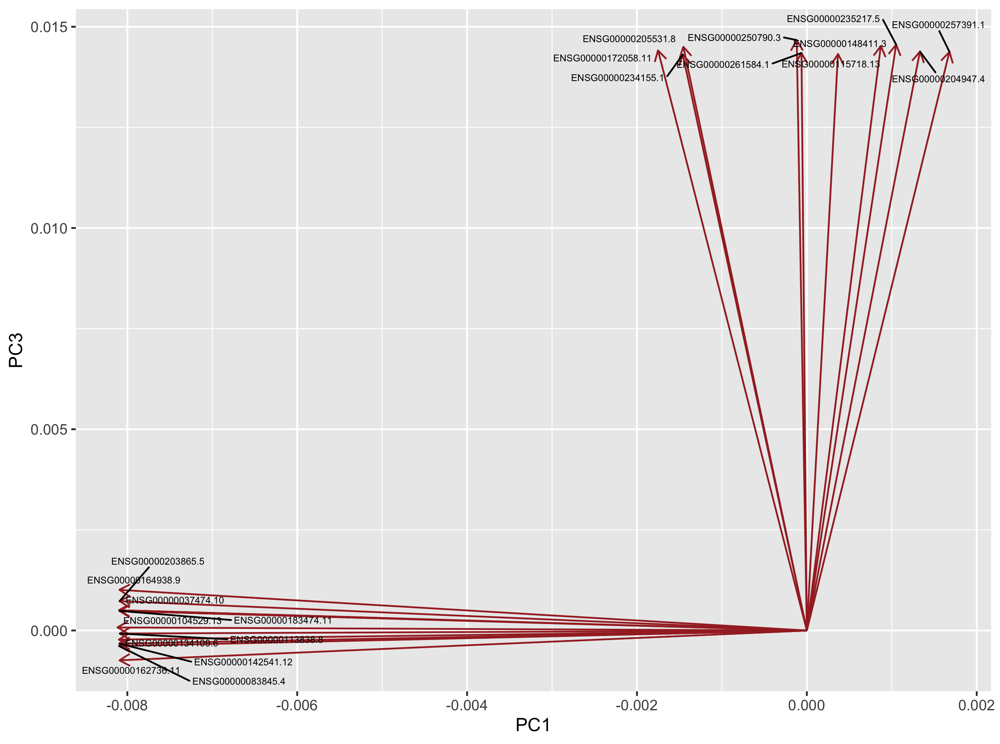

> ## Question
> Go to the [GTEx portal](https://www.gtexportal.org/home/) and search additional information about these genes.   
>  What do you think about the genes that are most related to PC1 and PC3? Are these likely to be adipose-specific genes?
{: .challenge}

[//]: # (plot the gene profile per tissue)

# 3. Time to practice
 

> ## Exercise 1
> Perform the PCA analysis _without_ prior scaling of the data. Hint: set the `scale` argument of the `mypca()` function to `FALSE`.     
> What are the consequences on the score and loading plots?
{: .challenge}

 

> ## Exercise 2
> Re-import the original data file and select the first 15 tissues instead of the first 10.   
> Create the score plots for PC1-PC2 and PC2-PC3.  
> How many PCs do you need to catch 80% of the variance now?
{: .challenge}   

 

# 4. References
- Hugo Tavares [PCA step-by-step guide](https://tavareshugo.github.io/data-carpentry-rnaseq/03_rnaseq_pca.html)
- Bradley Boehmke [Principal Component Analysis book section](https://bradleyboehmke.github.io/HOML/pca.html#the-idea-2)