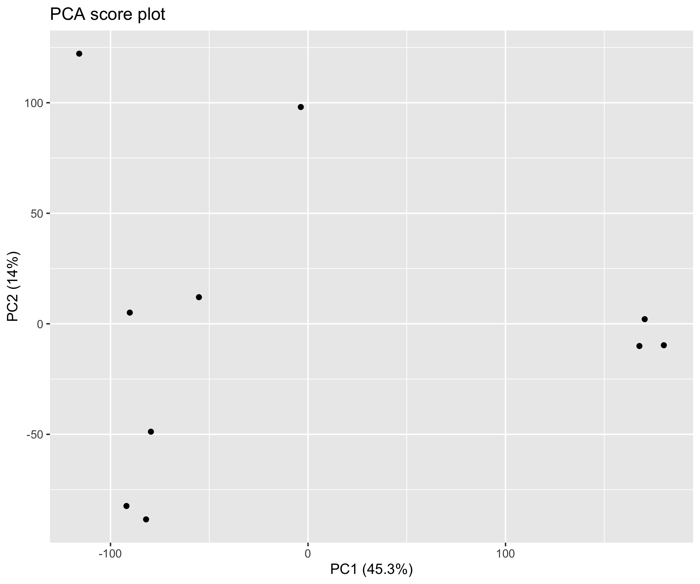

# Table of Contents

<!-- MarkdownTOC autolink="True" levels="1,2,3" -->

- [1. Principal Component Analysis](#1-principal-component-analysis)
   - [1.1 Introduction to PCA](#11-introduction-to-pca)
   - [1.2 The Iris dataset](#12-the-iris-dataset)
- [2. PCA analysis on dataset #1](#2-pca-analysis-on-dataset-1)
   - [2.1 The PCA R object](#21-the-pca-r-object)
   - [2.2 Scree plot](#22-scree-plot)
   - [2.3 PCA score plot](#23-pca-score-plot)
   - [2.4 PCA loading plot](#24-pca-loading-plot)
- [References](#references)

<!-- /MarkdownTOC -->

# 1. Principal Component Analysis

## 1.1 Introduction to PCA
In (bio)chemical analysis the data matrices can be very large. An infrared spectrum (800 wavelengths) for 50 samples for example would give a data matrix of size 40,000 (50x800) numbers.  A genomic data (e.g. 20,000 genes) for 100 patients would lead to a huge data matrix of (100x20,000) = 2,000,000 numbers. 

These matrices are so large that we need convenient ways to extract the important information from these large data matrices. 

Using principal component analysis (PCA) 

- The data is reduced to smaller matrices so they can more easily be examined, plotted and interpreted.
- The most important factors are extracted (principal components). These factors describe the multivariate (more than one variable) interactions between the measured variables.
- The samples can be classified to identify compound spectra, determine biomarkers etc.

To have an idea of how PCA works it should be noted that if there is a mutual relationship between two or more measurements (e.g. samples) they are correlated. These correlations can be strong (e.g. mass of object and weight on earth's surface) or weak (e.g. capabilities in sport and month of birth). In the example below there is a strong linear relationship between height and age for young children (*Moore, D.S. and McCabe G.P., Introduction to the Practice of Statistics (1989)*).

To explain PCA we use the example above and **project** the cases (observations) on a new coordinate system defined by principal component 1 (PC1) and principal component 2 (PC2) .

In this new coordinate system, PC1 explains 99.77% of the total variation of the original data set while PC2 only explains 0.23%. Consequently, only variable (PC1) is sufficient to describe the whole data set which would support the conclusion that there is only 1 underlying factor, in this case age.

If the original data has more than two variables (e.g. n), which usually is the case, the projection would be in the n-dimensional space. Consequently more than two principal components can be calculated. By using an optimal projection, the principal components describe the maximum variance and are calculated in order of importance e.g.

## 1.2 The Iris dataset

​The ability of PCA to capture as much variance as possible in the main principal components enables us to  to visualize (and summarize) the relation between objects (and variables) from a multi-dimensional space to a two dimensional plot.  

We can use the Fisher's famous Iris flower dataset from 1936 that describes three species of Iris (_Iris setosa_, _Iris virginica_ and _Iris versicolor_). The data set consists of 50 samples from each of these three species of Iris. Four features were measured from each sample: the length and the width of the sepals and petals, in centimeters ([source Wikipedia](https://en.wikipedia.org/wiki/Iris_flower_data_set)). See some pictures below.

| _Iris setosa_                                     | _Iris versicolor_                                  | _Iris virginica_                                        |
|---------------------------------------------------|----------------------------------------------------|---------------------------------------------------------|
|  |  | |

In the example below there is clear separation of the three types of [flowers](https://en.wikipedia.org/wiki/Iris_flower_data_set) which points to shared interactions between the different variables per group. 

To load this data in R  first the appropriate dataset have to be installed and loaded.
~~~
library(datasets)
data(iris)
head(iris)
~~~
{: .language-r}

~~~
Sepal.Length Sepal.Width Petal.Length Petal.Width Species
1          5.1         3.5          1.4         0.2  setosa
2          4.9         3.0          1.4         0.2  setosa
3          4.7         3.2          1.3         0.2  setosa
4          4.6         3.1          1.5         0.2  setosa
5          5.0         3.6          1.4         0.2  setosa
6          5.4         3.9          1.7         0.4  setosa
~~~
{: .output}

The summary of the iris data set display the content of the data. In this case the data consists of 150 objects with 5 variables. The last variable Species is a factor variable that specifies the class of the object.

~~~
 Sepal.Length    Sepal.Width     Petal.Length    Petal.Width          Species  
 Min.   :4.300   Min.   :2.000   Min.   :1.000   Min.   :0.100   setosa    :50  
 1st Qu.:5.100   1st Qu.:2.800   1st Qu.:1.600   1st Qu.:0.300   versicolor:50  
 Median :5.800   Median :3.000   Median :4.350   Median :1.300   virginica :50  
 Mean   :5.843   Mean   :3.057   Mean   :3.758   Mean   :1.199                  
 3rd Qu.:6.400   3rd Qu.:3.300   3rd Qu.:5.100   3rd Qu.:1.800                  
 Max.   :7.900   Max.   :4.400   Max.   :6.900   Max.   :2.500 
~~~
{: .output}

For convenience we use a very rudimentary (own) implementation implementation of PCA. Copy-paste this code into R to load this function into your environment and use it later on.

~~~
# define a custom R function called "mypca()""
mypca <- function(x, center = TRUE, scale = TRUE){  
  
  # perform SVD
  SVD <- svd(scale(x,center = center, scale = scale))
  
  # create scores data frame
  scores <- as.data.frame(SVD$u %*% diag(SVD$d))
  rownames(scores) <- rownames(x)
  colnames(scores) <- paste0("PC", c(1:dim(scores)[2]))
  
  # create loadings data frams
  loadings <- data.frame(SVD$v)
  colnames(loadings) <- paste0("PC", c(1:dim(loadings)[2]))
  rownames(loadings) <- colnames(x)
  
  # create data frame for explained variances
  explained_var <- as.data.frame(round((SVD$d^2) / sum(SVD$d^2)*100, digits = 1))
  rownames(explained_var) <- paste0("PC", c(1:dim(loadings)[2]))
  colnames(explained_var) <- "exp_var"
  
  # return result
  return (list("scores" = scores, "loadings" = loadings, "explained_var" = explained_var))
}
~~~
{: .language-r}

Now we have everything in our R environment into place, we can actually perform the PCA analysis and create the plots.  
Since the four first principal components catch most if not all 

~~~
# perform the PCA analysis on only the first 4 variables (skip the Species variable)
pca <- mypca(iris[,1:4], scale = FALSE)
scores = as.data.frame(pca$scores[,1:2])
scores['Species'] = iris$Species
explained_var = pca$explained_var$exp_var
~~~
{: .language-r}

In order to have an idea of how effective the 'compression' or variable reduction of the PCA algorithm was on our data set, we make a so-called 'scree' plot in which the explained variance is expressed as a function of the number of principal components.

~~~
# add a convenient column number for the bar plot to display
dfev <- data.frame(PC = c(1,2,3,4), exp_var  = pca$explained_var)

# make the plot
scree_plot <- ggplot(dfev, aes(x = PC, y = exp_var)) +
       ylab('explained variance (%)') + 
       ggtitle('explained variance per component') + 
       geom_bar(stat = "identity")

# display it
scree_plot
~~~
{: .language-r}

It is clear that the PCA really reduces our data to almost 1 variable (component) which explains over 90% of all the variance of the data. The second component only explains 5.3%. The third and fourth even less.

The whole idea behind the analysis is to visualize the high-dimensional data (e.g. a score plot) in a smaller dimensional space (e.g. 2D space). In R we can do that with the following lines of code

~~~
# plot the scores of the first 2 components
p <- ggplot(scores) + 
       geom_point(aes(x = PC1, y = PC2, shape = Species, col = Species)) + 
       xlab(paste0('PC1(',explained_var[1],'%)')) + 
       ylab(paste0('PC2(',explained_var[2],'%)')) + 
       ggtitle('PCA score plot')
p
~~~
{: .language-r}

From the score plot it is clear that the Setosa flowers are clearly different from the Versicolor/Virginica flowers. Versicolor and Virginica cannot be separated on PC1 and/or PC2. Looking at the PC1 vs PC3 however, the two groups can be separated better. It is very important to understand that even if a principal component explains a low amount of variance it still can contain interesting (biological) information. 

The scores are indicative of how the objects in the data set score in the new component space, correspondingly the loadings indicate how the variables score in the component space. The score plots above for example show a separation on PC1 between the 3 groups. If we would like to know which variables are important for this separation we can try to interpret our data.

~~~
library(reshape2) # to access the melt() function

# reformat the loading data
loadings <- melt(pca$loadings)
# rename the columns
colnames(loadings)<-c("Component","Value")
# add the 'original' variable names
loadings['Variable']=as.factor(rep(colnames(iris)[-5],4))
# plot the loading values per components
p <- ggplot(loadings,aes(x=Variable,y=Value)) +  geom_bar(stat='identity') + facet_wrap(~Component)
p
~~~
{: .language-r}

From the loading plot for PC1 it is clear that `Petal.Length` is the most important factor while `Sepal.Width` is the one which is least important. Because PC1 explains 92.5 % of the total variance we can conclude that `Petal.Length` is the most important factor that separates the three groups of flowers.   
There are many more things to learn on PCA (e.g. scaling, filtering) but that is out of the scope of these exercises. 

# 2. PCA analysis on dataset #1

## 2.1 The PCA R object

Let's create an object called `pca` that contains all the PCA information required later for plots. The `mypca()` function is a custom function that can be found [here](../extras/pca_function.md). 

~~~
pca <- df_expr %>% 
  column_to_rownames("gene_id") %>% 
  dplyr::select(- Description) %>% 
  with(., mypca(x = ., center = TRUE, scale = TRUE))
~~~
{: .language-r}

## 2.2 Scree plot
A scree plot is useful to determine the number of principal components to retain. It displays the explained variance (in %) as a factor of the number of PCs in the form of a downward curve. if an "elbow" can be seen on the curve with a flat line afterwards, you can retain the number of PCs that is indicated by the "elbow".

~~~
# Create a dataframe with all PC components (n = number of tissues)
exp_var_df <- data.frame(PC = seq(1:53), exp_var = pca$explained_var)

# make the complete screeplot
ggplot(exp_var_df, aes(x = PC, y = exp_var)) +
  ylab('explained variance (%)') + 
  ggtitle('explained variance per component (all principal components') + 
  geom_bar(stat = "identity")
~~~
{: .language-r}

> ## Exercise
> Based on the last plot, how many PCs do you think are necessary to catch most of the variation in the data?
> > ## Solution
> > One component seems to be enough to catch around 80\% of the total variance.
> {: .solution}
{: .challenge }

We can "zoom in" by taking only the first five principal components to see how the explained variance per component evolves along with additional principal components.  

~~~
ggplot(exp_var_df[1:5,], aes(x = PC, y = exp_var)) +
  ylab('explained variance (%)') + 
  ggtitle('explained variance per component (only first 5 principal components)') + 
  geom_bar(stat = "identity") +
  labs(x = "Principal Component")
~~~
{: .language-r}

The plot below clearly shows that only one principal component manages to catch up as much as 80\% of the total variance. This is actually a sign that we should easily distinguish the different tissues using only one PC. 

## 2.3 PCA score plot
The score plot will indicate how 

Let's first create a dataframe containing the gene scores in the new dimensional space created by the computed PCs.  
~~~
scores <- pca$scores
scores[1:5,1:5]
~~~
{: .language-r} 

~~~
                          PC1         PC2          PC3         PC4          PC5
ENSG00000223972.4 -0.30035641 -0.11242079 -0.006871925 0.009222968 -0.005103927
ENSG00000227232.4 -0.05115296  0.01722664 -0.008243997 0.013950002 -0.015618584
ENSG00000243485.2 -0.30089985 -0.11217751 -0.006927010 0.009235968 -0.004851915
ENSG00000237613.2 -0.30135627 -0.11213555 -0.006915154 0.009235249 -0.004905633
ENSG00000268020.2 -0.30168986 -0.11225956 -0.006938164 0.009248330 -0.004895056
~~~
{: .output}

You see that each gene has coordinates on each PC ("axis") of the new dimensional space. That means that we can display these points as a 2D plot using two PCs at a time.  

First, we need to 
Let's do this with PC1 and PC2. 

~~~
scores <- pca$scores

# extract explained variance per component for plot axis labels
explained_var = pca$explained_var$exp_var

# plot the scores of the first 2 components
ggplot(scores) + 
  geom_point(aes(x = PC1, y = PC2)) + 
  xlab(paste0('PC1(',explained_var[1],'%)')) + 
  ylab(paste0('PC2(',explained_var[2],'%)')) + 
  ggtitle('PCA score plot')
~~~
{: .language-r}

 

This is not the most informative plot since genes seems to be mostly grouped together on the left of the plot. 

## 2.4 PCA loading plot

The loadings will tell us how the different tissues score in the new dimensional space. To plot them, we will need to do a bit of reshaping of our `pca$loadings` dataframe. 

~~~
loadings <- pca$loadings %>% rownames_to_column("tissue") %>% pivot_longer(cols = - tissue)
~~~

# References