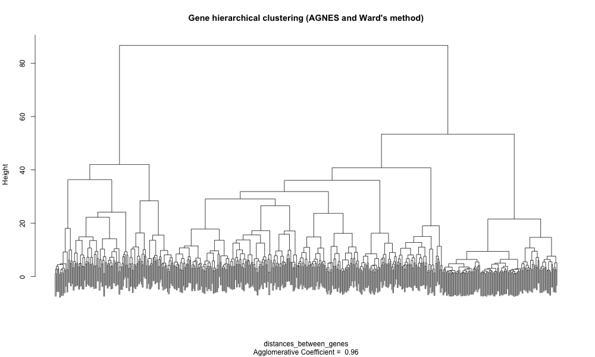
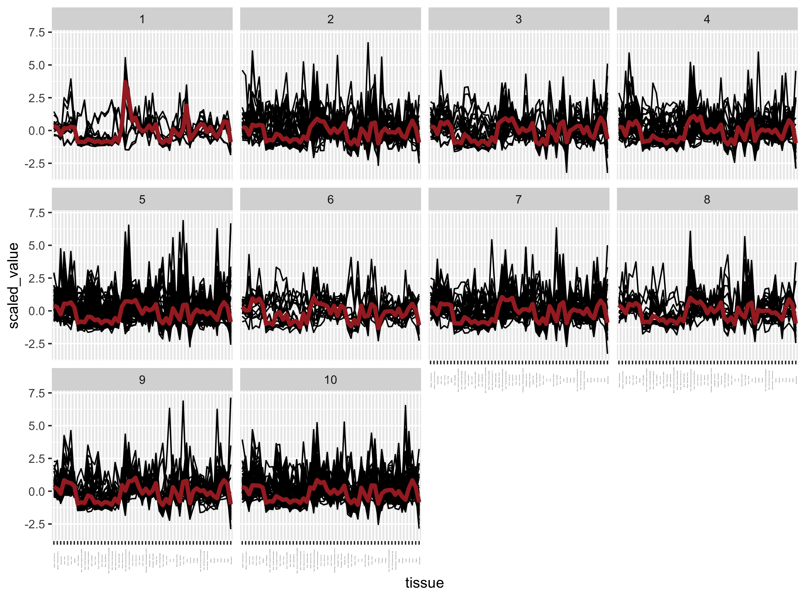

# Table of Contents

<!-- MarkdownTOC autolink="True" -->

- [1. Introduction](#1-introduction)
    - [1.1 Objective](#11-objective)
    - [1.1 Library and Data import](#11-library-and-data-import)
- [2. Hierarchical Clustering of the tissues](#2-hierarchical-clustering-of-the-tissues)
    - [2.1 Scaling](#21-scaling)
    - [2.2 Distance matrix](#22-distance-matrix)
        - [Simple example](#simple-example)
        - [Real example](#real-example)
    - [2.3 Tissue hierarchical clustering](#23-tissue-hierarchical-clustering)
- [3. Hierarchical clustering of the genes](#3-hierarchical-clustering-of-the-genes)
    - [3.1 Selecting a gene subset](#31-selecting-a-gene-subset)
    - [3.2 Gene clustering](#32-gene-clustering)
- [4. Heatmaps](#4-heatmaps)
- [Gene expression profile](#gene-expression-profile)
- [5. Time to practice](#5-time-to-practice)
- [References](#references)

<!-- /MarkdownTOC -->

# 1. Introduction

## 1.1 Objective 
Since PCA did not exactly yielded obvious adipose-specific gene candidates, here we are going to implement a _clustering_ approach. This method will try to identify groups of genes with similar expression profiles in subcutaneous adipose tissues compared to other tissues.      

In this section, clustering will refer exclusively to __hierarchical clustering__, a process to identify groups in a dataset. Contrarily to to other methods such as K-means clustering for instance, one doesn't know the number of clusters in advance.   

> ## Objective
> Our objective in this episode here is to define a cluster of genes that behave similarly in subcutaneous adipose tissue as compared to the other tissues. 
{: .objectives}

## 1.1 Library and Data import 

We import the libraries and dataset once more to provide a clean start.  
~~~
suppressPackageStartupMessages(library("tidyverse"))
suppressPackageStartupMessages(library("cluster"))
suppressPackageStartupMessages(library("pheatmap"))

df_expr <- read.delim(file = "data/GTEx_Analysis_2016-01-15_v7_RNASeQCv1.1.8_gene_median_tpm.tsv", 
                      header = TRUE, 
                      stringsAsFactors = FALSE,
                      check.names = FALSE)

# conversion to matrix for distance calculation later
mat_expr <- df_expr %>% 
  dplyr::select(- Description) %>% 
  column_to_rownames("gene_id") %>% 
  as.matrix()
~~~
{: .language-r}

# 2. Hierarchical Clustering of the tissues

## 2.1 Scaling 

As seen previously, scaling is a procedure to ensure that all genes (variables) are comparable before doing further analysis. For instance, some genes will have a very high expression while others will be close to zero.   
Try this:  
~~~
min(mat_expr)
max(mat_expr)
~~~
{: .language-r}

We perform scaling (mean centering and variance scaling0 on the expression matrix using the `scale()` function. Since this function scales __columns__ rather than rows, we will have to transpose the matrix before scaling and once more to return it to its original format.
~~~
mat_expr_scaled <- mat_expr %>% 
  t() %>% 
  scale(center = TRUE, scale = TRUE) %>% 
  t() %>% 
  na.omit()

mean(mat_expr_scaled[1,]) # mean for ENSG00000223972.4  (close to 0)
sd(mat_expr_scaled[1,])   # standard deviation for ENSG00000223972.4 (unit variance of 1)
~~~
{: .language-r}

## 2.2 Distance matrix

To perform the clustering itself, we need to compute a so-called distance matrix between every tissue in a pairwise manner. 
Here, we will use the __Euclidean distance__ and compute it for each tissue pair. 

### Simple example
Let's explain how it is calculated using a simple example. Feel free to run the following code:  

~~~
# sample 1 and 2
sample_a = c(1,2,3)
sample_b = c(1,2,3)

# Source: https://stackoverflow.com/questions/5559384/euclidean-distance-of-two-vectors
euc.dist <- function(x1, x2) sqrt(sum((x1 - x2) ^ 2))
euc.dist(sample_a, sample_b)
~~~
{: .language-r}

The distance is 0 because the two samples have the same coordinates in their 3-dimensional space (x = 1, y = 1, z = 1).

~~~
sample_a = c(1,2,6)
sample_b = c(1,2,3)
euc.dist(sample_a, sample_b) # equal to 3

# if you do it manually
sqrt(sum(1 - 1)^2 + sum(2 - 2)^2 + sum(6 -3)^2)
~~~
{: .language-r}

### Real example

In our case, for every tissue, we have 56,202 gene expression which would be impossible to calculate by hand. Fortunately, R will do this for us. 

We will use the `dist()` function for this. In the related `dist()` function help, it says: 
> This function computes and returns the distance matrix computed by using the specified distance measure to compute the distances between the rows of a data matrix.

Since we do not want the distance between genes but rather between tissues, we have to transpose the matrix first. 
~~~
distances_between_tissues <- dist(
    t(mat_expr_scaled),                       # notice the t() to calculate the distances between tissues, not between genes
    method = "euclidean")
as.matrix(distances_between_tissues)[1:5,1:3]
~~~
{: .language-r}

You can notice that the distances between the same tissue is equal to 0 (null distance).
~~~
                             Adipose - Subcutaneous Adipose - Visceral (Omentum) Adrenal Gland
Adipose - Subcutaneous                      0.00000                     96.05766      200.2761
Adipose - Visceral (Omentum)               96.05766                      0.00000      182.7446
Adrenal Gland                             200.27614                    182.74462        0.0000
~~~
{: .language-r}

## 2.3 Tissue hierarchical clustering 

Let's use the AGNES (AGlomerative NESting) method from the `cluster` package as it produces smaller clusters than other methods. This could help to identify small meaningful tissue-specific clusters. In addition, we will use the Ward's method to estimate the distance between two clusters of tissues. Ward's method minimizes the within-cluster variance. 

~~~
# The AGNES clustering method coupled to Ward's cluster dissimilarity estimation method
hcl_tissue_ward <- cluster::agnes(x = distances_between_tissues,method = "ward")

You can already create a dendrogram from this hierarchical cluster object (zoom to get additional details)
plot(hcl_tissue_ward)
~~~
{: .language-r}

Notice how the two _adipose_ tissues are clustered together on the left with the _breast_ tissue. 

  
> ## Note 
> Notice that an agglomerative coefficient (ac) equal to 0.84 is indicated below the plot. This coefficient measures the clustering structure of the dataset.
> For each observation i, denote by m(i) its dissimilarity to the first cluster it is merged with, divided by the dissimilarity of the merger in the final step
> of the algorithm. The ac is the average of all 1 - m(i). It can also be seen as the average width (or the percentage filled) of the banner plot. Because ac > grows with the number of observations, this measure should not be used to compare datasets of very different sizes. 
{: .callout}

Let's see how different methods of cluster dissimilarity performs relative to this agglomerative coefficient.
~~~
# methods to assess
m <- c( "average", "single", "complete", "ward")
names(m) <- c( "average", "single", "complete", "ward")

# function to compute coefficient
ac <- function(d = distances_between_tissues, x) {
  agnes(d, method = x)$ac
}

# get agglomerative coefficient for each linkage method
purrr::map_dbl(m, function(x) ac(distances_between_tissues, x))
~~~
{: .language-r}

According to the results, it seems that Ward's method gives the highest agglomerative coefficient.
~~~
##   average    single  complete      ward 
## 0.9139303 0.8712890 0.9267750 0.9766577
~~~
{: .output}

# 3. Hierarchical clustering of the genes

While tissue clustering was relatively easy due to the low number of tissues i.e. 53, there are simply too many genes (56,202) to perform a brute-force clustering approach. 

Usually, one first search for differentially expressed genes for instance and then perform a clustering on this gene subset rather than the whole complete set.

Here, we are going to select the most highly expressed genes in order to find specific and highly-expressed genes. 

## 3.1 Selecting a gene subset

To select a threshold for "highly expressed genes" in a meaningful way, we can compute the [percentiles](https://en.wikipedia.org/wiki/Percentile) of the gene TPM values.  

~~~
df_expr_tidy <- df_expr %>%
  select(- Description) %>% 
  pivot_longer(- gene_id, names_to = "tissue", values_to = "tpm")

# getting the percentiles
df_expr_tidy %>% 
  group_by(gene_id) %>% 
  summarise(median_tpm = median(tpm)) %>% 
  with(., round(x = quantile(x = median_tpm, probs = c(
    seq(from = 0,
        to = 0.9,
        by = 0.1), 
    seq(from = 0.9, to = 1, by = 0.01)),
                digits = 2)
       )
    )
~~~
{: .language-r}

This indicates that 90% of the genes have a median TPM value inferior to 16.50. 

~~~
0%   10%   20%   30%   40%   50%   60%   70%   80%   90%   90%   91%   92%   93%   94%   95%   96%   97%   98%   99%  100% 
0     0     0     0     0     0     0     1     4    16    16    19    21    24    28    34    40    50    67    112  34805 
~~~
{: .output}

By keeping only the "very highly expressed genes" (> 99th percentile), our number of genes under investigation falls from 56,202 to 560. 
~~~
genes_selected = 
  df_expr_tidy %>% 
  group_by(gene_id) %>% 
  summarise(median_tpm = median(tpm)) %>% 
  ungroup() %>% 
  filter(median_tpm > 112) %>% 
  dplyr::pull(gene_id)
~~~
{: .language-r} 

## 3.2 Gene clustering

Our gene expression set has already been converted to a matrix and scaled before (see section 2.1): the corresponding R object is called `mat_expr_scaled`.  
Therefore, we will subset this matrix using our list of selected genes. 

~~~
genes_mat <- subset(x = mat_expr_scaled, 
                    subset = rownames(mat_expr_scaled) %in% genes_selected)
~~~
{: .language-r}

We then perform the whole distance to plot in one go. 
~~~
distances_between_genes = dist(x = genes_mat, method = "euclidean")

# The AGNES clustering method coupled to Ward's cluster dissimilarity estimation method
hcl_genes_ward <- cluster::agnes(x = distances_between_genes, method = "ward")

# You can already create a dendrogram from this hierarchical cluster object (zoom to get additional details)
plot(hcl_genes_ward,
     labels = FALSE,  # remove unreadable gene names
     which.plots = 2,
     main = "Gene hierarchical clustering (AGNES, Ward method)")
~~~
{: .language-r}

Groups of genes are visible on this dendrogram but we miss their relationship with the different tissues. 
An option is to create a heatmap (false color matrix of expression values) with the tissue and gene clustering information superposed. 

# 4. Heatmaps

The `pheatmap` package is composed of a unique function called `pheatmap()`. The latter has many arguments and options that you can consult [here](https://www.rdocumentation.org/packages/pheatmap/versions/1.0.12/topics/pheatmap).

One nice feature is the ability to pass our own clustering objects when building the heatmap. The only "trick" is to make sure the R objects are of class "hclust".
~~~
pheatmap(genes_mat, 
         show_rownames = FALSE, 
         cluster_rows = as.hclust(hcl_genes_ward), 
         cluster_cols = as.hclust(hcl_tissue_ward), 
         scale = "none")
~~~
{: .language-r}

This yields the following heatmap:

> ## Discussion
> How easy is it to retrieve the very highly expressed genes related to the subcutaneous adipose tissue?
{: .discussion}

 

# Gene expression profile

~~~
genes <- labels(as.dendrogram(hcl_genes_ward))

gene_to_cluster_group <- cutree(tree = hcl_genes_ward, k = 10) %>% 
  enframe() %>% 
  rename(gene = name, cluster = value) %>% 
  mutate(gene_id = genes)

mat_expr_scaled_with_clusters = 
  mat_expr_scaled %>%
  as.data.frame() %>% 
  rownames_to_column("gene_id") %>% 
  pivot_longer(cols = - gene_id, names_to = "tissue", values_to = "scaled_value") %>%  
  inner_join(x = ., y = gene_to_cluster_group, by = "gene_id") 
  

ggplot(mat_expr_scaled_with_clusters, aes(x = tissue, y = scaled_value)) +
  geom_line(aes(group = gene_id)) +
  facet_wrap( ~ cluster) +
  stat_summary(aes(group = 1), fun = "median", colour = "brown", geom = "line", size = 1.5) +
  theme(axis.text.x = element_text(angle = 90, size = 1))
~~~
{: .language-r}

> ## Exercise
> 1. There is clearly an issue with the previous plot. Can you determine which one?
> 2. Can you correct the code to plot the correct figure then?
>
> > ## Solution
> > The gene expression profiles per cluster are not very different from each other while they should.  
> {: .solution}
{: .challenge}

# 5. Time to practice
 

> ## Exercise
> Using the `mat_expr_scaled` scaled matrix of gene expression values, try to build several heatmaps with the pheatmap function:
> 1. Using the first 1000 genes in the matrix.
> 2. Using the first 5000 genes in the matrix.    
> 3. See how far you can get 
> Note: the heatmap construction will take increasing times to build.
> Do you manage to identify a cluster of adipose-specific genes?
{: .challenge}

 

> ## Warning 
> Be careful! Do not attempt to perform the clustering on the whole matrix (around 42000 genes), you might crash your computer or be stuck so be careful with the number you choose. Rather, filter out low expressed genes in order to keep the maximum amount of information in your analysis. 
{: .callout}

# References
- [Exploring gene expression patterns using clustering](https://tavareshugo.github.io/data-carpentry-rnaseq/04b_rnaseq_clustering.html)
- [The R pheatmap package](https://cran.r-project.org/web/packages/pheatmap/)