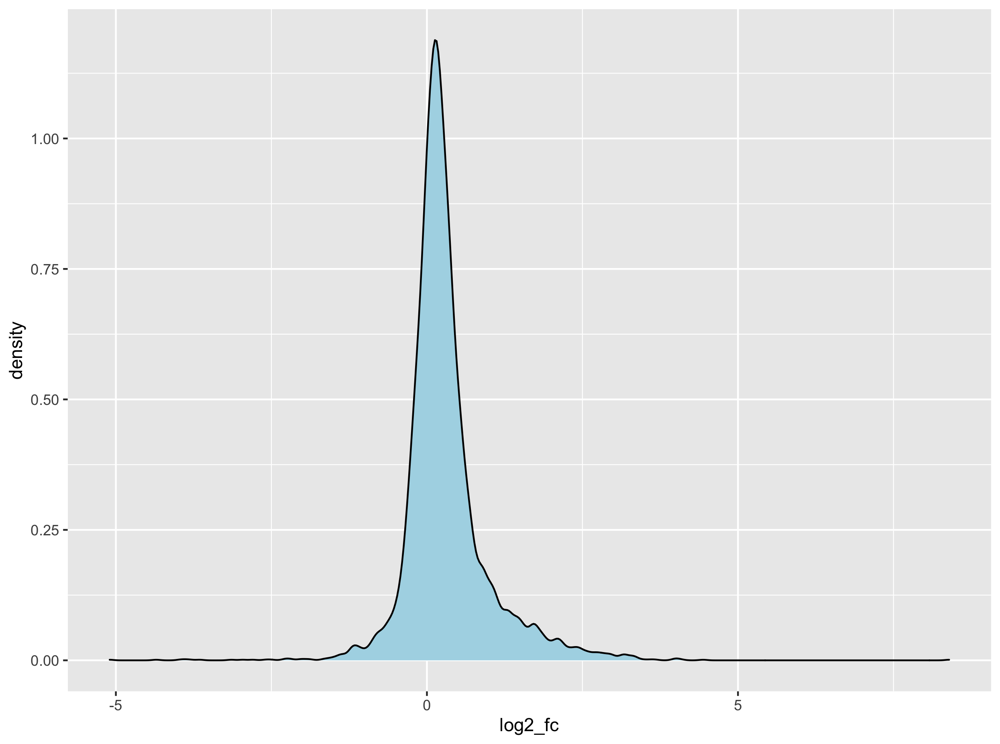

# Table of Contents

<!-- MarkdownTOC autolink="True" -->

- [1. Introduction](#1-introduction)
- [2. Feature engineering](#2-feature-engineering)
  - [2.1 Filtering genes with low expression values](#21-filtering-genes-with-low-expression-values)
  - [2.2 Creating the adipose and other tissues dataframes](#22-creating-the-adipose-and-other-tissues-dataframes)
  - [2.3 Merge dataframes and calculate log2 fold changes](#23-merge-dataframes-and-calculate-log2-fold-changes)
- [3. Compute $$Z$$-tests and extract adipose-specific  genes](#3-compute-%24%24z%24%24-tests-and-extract-adipose-specific-genes)
  - [3.1 Normality test](#31-normality-test)
  - [3.2 $$Z$$-test](#32-%24%24z%24%24-test)
  - [3.3 Compute p-values and extract final list](#33-compute-p-values-and-extract-final-list)

<!-- /MarkdownTOC -->

# 1. Introduction

There is an alternative perhaps more intuitive method to find tissue-specific genes. Actually this is the method used by Ahn and co-authors [in their publication](https://www.nature.com/articles/s41598-019-39582-8). 

Here are the different steps that will be undertaken:
1. Create a dataframe that only contains the gene TPM values for our tissue of interest (e.g. subcutaneous adipose tissue)
2. Create a dataframe that contains _all other_ tissues gene TPM values. 
3. Compute the median TPM value per gene for the other tissues. 
4. Join the two dataframes. 
5. Calculate the _subcutaneous adipose_ versus _all other tissues__ fold changes. 
6. Converting this fold change to a $$log_{2}$$ fold change to normalise the distribution of the fold changes. 
7. Perform a $$Z$$-test analysis to compute p-values.
8. Extract the genes with the highest and most significant $$log_{2}$$ fold changes.  

# 2. Feature engineering

Here, feature engineering refers to the grouping of the other tissues under a new variable called "other_tissues". This will turn our complex multivariate analysis (see PCA and clustering episodes) into a simpler univariate analysis. 

## 2.1 Filtering genes with low expression values

Import or re-import the data first. 
~~~
df_expr <- read.delim(file = "data/GTEx_Analysis_2016-01-15_v7_RNASeQCv1.1.8_gene_median_tpm.tsv", 
                      header = TRUE, 
                      stringsAsFactors = FALSE,
                      check.names = FALSE)

df_expr_tidy <- df_expr %>%
  select(- Description) %>% 
  pivot_longer(- gene_id, names_to = "tissue", values_to = "tpm")
~~~
{: .language-r}

~~~
threshold = df_expr_tidy %>% 
  group_by(gene_id) %>% 
  summarise(median_tpm = median(tpm)) %>% 
  with(., round(x = quantile(x = median_tpm, probs = 0.9)))

genes_selected = 
  df_expr_tidy %>% 
  group_by(gene_id) %>% 
  summarise(median_tpm = median(tpm)) %>% 
  ungroup() %>% 
  filter(median_tpm > threshold) %>% 
  dplyr::pull(gene_id)

df_expr_tidy_filtered <- filter(df_expr_tidy, gene_id %in% genes_selected)
~~~
{: .language-r}

## 2.2 Creating the adipose and other tissues dataframes
~~~
# extract gene TPM value in "Adipose - Subcutaneous"  
adipose_gene_expression <- df_expr_tidy_filtered %>% 
  filter(tissue == "Adipose - Subcutaneous") %>% 
  select(gene_id, tpm) %>% 
  rename(adipose_tpm = tpm)

# calculate median TPM value in all other tissues
all_other_tissues_gene_expression <- 
  df_expr_tidy_filtered %>% 
  filter(tissue != "Adipose - Subcutaneous") %>% 
  group_by(gene_id) %>% 
  summarise(other_tissues_median_tpm = median(tpm))
~~~
{: .language-r}

## 2.3 Merge dataframes and calculate log2 fold changes
~~~
## Merge the two dataframes
## Calculate a fold change
adipose_vs_other_tissues <- inner_join(x = adipose_gene_expression, 
                                       y = all_other_tissues_gene_expression, 
                                       by = "gene_id") %>% 
  mutate(fc = adipose_tpm / other_tissues_median_tpm) %>% 
  mutate(log2_fc = log2(fc)) 
~~~
{: .language-r}

# 3. Compute $$Z$$-tests and extract adipose-specific  genes 

Since our sample size is relatively large (> 50), we can perform a $$Z$$-test analysis to compute the probability 

## 3.1 Normality test

~~~
# normal distribution of log2FC?
ggplot(adipose_vs_other_tissues, aes(x = log2_fc)) +
  geom_density()

  # calculate Z-score 
mean_of_log2fc <- with(data = adipose_vs_other_tissues, mean(log2_fc))
sd_of_log2fc <- with(data = adipose_vs_other_tissues, sd(log2_fc))

# test for normality
ks.test(x = adipose_vs_other_tissues$log2_fc, y = "pnorm", mean = mean_of_log2fc, sd = sd_of_log2fc)
~~~
{: .language-r}

<figure>
  
  <figcaption>Distrinbution of gene log2 fold changes</figcaption>
</figure> 

The [Kolmogorov–Smirnov test](https://en.wikipedia.org/wiki/Kolmogorov%E2%80%93Smirnov_test) that compares the observed distribution of the $$log_{2}$$ fold change to its theoretical normal distribution (based on its observed mean and variance). The _null_ hypothesis stipulates that the observed distribution are drawn from its theoretical normal distribution. A large $$D$$ score will convert to a small p-value therefore suggesting that the distribution significantly deviates from its theoretical normal distribution.     

~~~
One-sample Kolmogorov-Smirnov test

data:  adipose_vs_other_tissues$log2_fc
D = 0.14537, p-value < 2.2e-16
alternative hypothesis: two-sided

~~~
{: .output}

Although our data is not strictly normal _sensu stricto_, we will assume it is for demonstration purposes and since a high $$log_{2}$$ will nethertheless indicate a high expression in subcutaneous adipose tissue.

## 3.2 $$Z$$-test

The $$Z$$-test can be used to test whether an observed $$log_{2}$$ fold change is significantly different from the population average $$log_{2}$$ fold changes. To perform this analysis, we can compute the $$Z$$-score for each of the $$log_{2}$$. In turn, this allows to convert this score to a probability for each of the individual gene fold change.   

~~~
adipose_vs_other_tissues$zscore <- map_dbl(
  adipose_vs_other_tissues$log2_fc, 
  function(x) (x - mean_of_log2fc) / sd_of_log2fc
  )
~~~
{: .language-r}

## 3.3 Compute p-values and extract final list

Here, p-values will be extracted using a one-tailed p-value since we want log2 fold changes higher than 
~~~
# filter fc > 0 + calculate one-sided p-value
adipose_specific_genes = 
  adipose_vs_other_tissues %>%  
  filter(log2_fc > 0) %>%                   # FC superior to 1
  mutate(pval = 1 - pnorm(zscore)) %>%      # one-tailed p-value
  filter(pval < 0.01) %>% 
  arrange(desc(log2_fc))

head(adipose_specific_genes, n = 10)
~~~
{: .language-r}

This yields the top 10 genes:
~~~
# A tibble: 10 x 7
   gene_id           adipose_tpm other_tissues_median_tpm    fc log2_fc zscore     pval
   <chr>                   <dbl>                    <dbl> <dbl>   <dbl>  <dbl>    <dbl>
 1 ENSG00000170323.4       5946.                     17.7 336.     8.39  12.1  0.      
 2 ENSG00000196616.8       1302                      60.0  21.7    4.44   6.16 3.54e-10
 3 ENSG00000165507.8       1019                      59.8  17.0    4.09   5.64 8.47e- 9
 4 ENSG00000197766.3       2090.                    129.   16.2    4.02   5.53 1.60e- 8
 5 ENSG00000131471.2        320.                     19.9  16.0    4.00   5.51 1.79e- 8
 6 ENSG00000174807.3        374.                     23.8  15.8    3.98   5.47 2.19e- 8
 7 ENSG00000167772.7        221.                     17.3  12.7    3.67   5.02 2.65e- 7
 8 ENSG00000147872.5        326.                     27.0  12.1    3.59   4.90 4.77e- 7
 9 ENSG00000145824.8        518.                     46.3  11.2    3.48   4.73 1.10e- 6
10 ENSG00000008394.8        168.                     16.0  10.5    3.39   4.59 2.17e- 6
~~~
{: .language-r}

In total, you should have __195__ genes with a significant positive fold change related to subcutaneous adipose tissue.  
 

> ## Exercise 1
> Navigate to the [GTEx portal](https://www.gtexportal.org/home/) and search for additional information about these genes.
{: .challenge}

 

> ## Exercise 2
> Heatmap revived! Using the list of subcutaneous adipose-related genes:
> 1. Filter the original dataset to keep only the 195 adipose-related genes.
> 2. Convert to matrix and scale the matrix so that gene expression values become comparable. 
> 3. Build a heatmap using your own clustering method (or the default one from `pheatmap()`)
> 4. Now try to keep only the top 20 genes with the highest fold change and rebuild your heatmap.  
{: .challenge}

