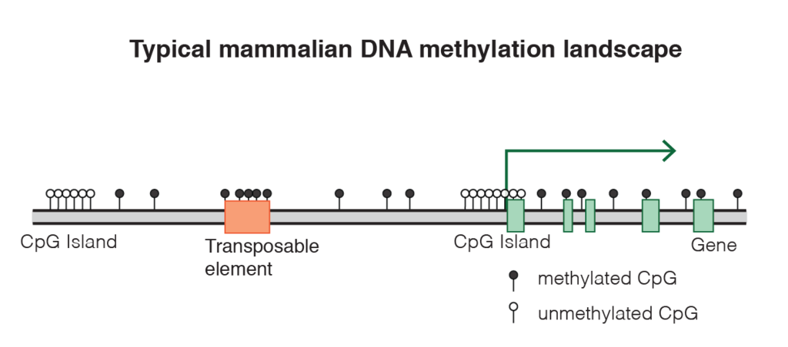

# Table of contents
<!-- MarkdownTOC autolink="True" levels="1,2" -->

- [Introduction](#introduction)
	- [Aging](#aging)
	- [Epigenetic clock](#epigenetic-clock)
	- [CpG islands](#cpg-islands)
- [Dataset description](#dataset-description)
	- [Provenance](#provenance)
	- [Beta values](#beta-values)
- [Get started](#get-started)
- [References](#references)
	- [Dataset links](#dataset-links)
	- [Useful links](#useful-links)
	- [Photo credits](#photo-credits)

<!-- /MarkdownTOC -->

# Introduction

## Aging
Aging (also spelled ageing) or is the process of becoming older. From a biological perspective, the term “aging” is not clearly defined as it can refer to aging of human beings, animals or other organisms. In this context chronological age and biological age are frequently confused. An individual’s age is usually defined based on chronological time, but on the other hand it is well accepted that individuals age at different rates. More generally, aging can also refer to time-related changes in cells within an organism (cellular senescence) or to changes in the population of a species (population aging). In this practical, we will focus on the aging of human individuals.  

In humans, aging represents the accumulation of changes in a human being over time, encompassing physical, psychological, and social change. At the cellular and molecular levels, the process of aging results in a wide range of changes, which include senescence, telomere shortening, and changes in gene expression. 

<figure>
  
  <figcaption>L'heureuse vieillesse ("happy old age")</figcaption>
</figure> 

## Epigenetic clock
Epigenetic patterns also change over the lifespan, suggesting that epigenetic changes may constitute an important component of the aging process. The epigenetic mark that has mostly been studied is __DNA methylation__, the presence of methyl groups at CpG dinucleotides. These dinucleotides are often located near gene promoters and associate with gene expression levels. Thus, DNA methylation can play essential roles during development, acting through the regulation of gene expression.

The measure of age using DNA methylation levels can be called an __epigenetic clock__. 

## CpG islands 

In genomes, some regions contain a high amount of CG sites (one cytosine followed by one guanine) and are called __CpG islands__. The cytosine of a CG site within a CpG island can be the target for 5-methylation which in turn can alter nearby gene expression. 

<figure>
  
  <figcaption>Mammalian DNA methylation landscape (source: Wikipedia)</figcaption>
</figure> 

Approximately 60–70% of genes have a CpG island associated with their promoters, and promoters can be classified according to their CpG density. Levels of DNA methylation at a promoter-associated CpG island are generally negatively associated with gene expression, although some specific genes show the opposite effect. Interestingly, this negative correlation is not upheld when comparing expression and DNA methylation for a specific gene across individuals. Conversely, DNA methylation in the gene body is often positively associated with levels of gene expression. Although direct causal relationships between DNA methylation, gene expression and mechanisms of aging have not been established so far, it has been shown that systematic age-related changes in DNA methylation do occur. 

Specific tools such as microarrays have been designed to measure the level of methylation of thousands of CpG islands simultaneously. For instance, the [Illumina Methylation Assay](https://en.wikipedia.org/wiki/Illumina_Methylation_Assay) can be used to measure simultaneously 27,578 CpG dinucleotides from the Human genome.
In total, 14,495 genes can have their CG site methylation state assayed.   

# Dataset description

## Provenance

The dataset contains the genome-wide DNA methylation profiles of saliva samples from male identical twins from age 21 to 55. 

The [Illumina Infinium 27k Human DNA methylation Beadchip v1.2](https://www.illumina.com/science/technology/microarray/infinium-methylation-assay.html) was used to obtain DNA methylation profiles across approximately 27,000 CpGs in bisulfite converted DNA. Samples included 34 pairs of identical twins and one set of identical triplets, and 13 hybridisations were technical replicates of a selection of those samples.

## Beta values
Beta values indicate the extent of DNA methylation at a given site as measured by the Values range from 0 (completely unmethylated CG site) to 1 (completely methylated).  

# Get started

> ## Lesson section objective 
> In this practical you will perform genome-wide epigenetic analyses to investigate the relationship between human aging and DNA methylation.
{: .objectives}

> ## Checklist
> 1. Download the CpG methylation and age datasets: [https://doi.org/10.5281/zenodo.4054842](https://doi.org/10.5281/zenodo.4054842).
> 2. Read the publication of [Bocklandt et al. 2011](https://doi.org/10.1371/journal.pone.0014821) to understand the biological provenance of this dataset
> 3. Open RStudio and create a new script called `age.R` for instance. 
> 4. Load the `tidyverse` and `broom` packages with `library()``. 
{: .checklist}

# References

## Dataset links
- Gene Expression Omnibus [accession GSE28746](https://www.ncbi.nlm.nih.gov/geo/query/acc.cgi?acc=GSE28746)
- Bocklandt S, Lin W, Sehl ME, Sánchez FJ, Sinsheimer JS, Horvath S, Vilain E. (2011) Epigenetic predictor of age. _PLoS One_. 6(6):e14821. [Link](https://doi.org/10.1371/journal.pone.0014821) 

## Useful links
- Wikipedia article on [Epigenetic Clock](https://en.wikipedia.org/wiki/Epigenetic_clock)

## Photo credits
- L'heureuse vieillesse ("happy old age") by Louis Jean François Lagrenée. [Link](https://upload.wikimedia.org/wikipedia/commons/1/15/Louis_Jean_Fran%C3%A7ois_Lagren%C3%A9e_%281725-1805%29_-_%27L%27heureuse_vieillesse%27_-_732294_-_National_Trust.jpg)