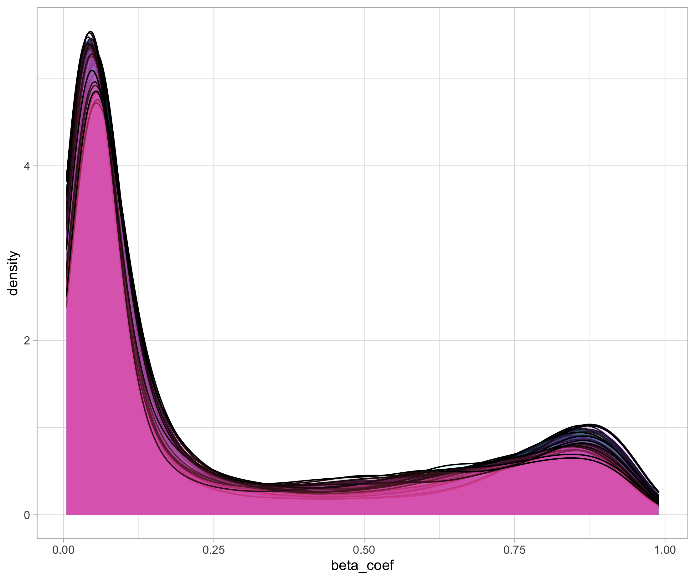

# Table of Contents

<!-- MarkdownTOC autolink="True" levels="1,2,3" -->

- [Data exploration](#data-exploration)
  - [Number and distribution of beta values](#number-and-distribution-of-beta-values)
  - [Heatmap of differential CpG islands](#heatmap-of-differential-cpg-islands)
    - [Multiple one-factor ANOVAs](#multiple-one-factor-anovas)
    - [Detailed explanation: nest - map - unnest workflow](#detailed-explanation-nest---map---unnest-workflow)
    - [Filtering non-differential CpG sites](#filtering-non-differential-cpg-sites)
- [References](#references)

<!-- /MarkdownTOC -->

# Data exploration

## Number and distribution of beta values

> ## Question
> Are the number of CpG per sample comparable?
> > ## Solution
> > Yes absolutely. In fact, there are exactly 27,578 CG sites measured for each sample. 
> >  ~~~
> > df_cpg_tidy %>% group_by(sample) %>% tally() %>% summary()
> > ~~~
> > {: .language-r}
> {: .solution}
{: .challenge}

Since the beta values arise from a microarray hybridization, there is _always_ a signal associated to each CpG probe set. Some signals might be filtered but usually each probe get assigned a value.
 

> ## Question
> Can you make a density plot to show the distribution of beta values across the different samples? Overlay all density curves so you can see if one sample is very different from the others (possible outlier).
> > ## Solution
> > ~~~
> > df_cpg_tidy %>% 
> >   ggplot(data = ., aes(x = beta_coef, fill = sample)) + 
> >       geom_density(alpha = 0.1) +
> >       guides(fill = FALSE) 
> > ~~~
> > {: .language-r}
> {: .solution}
{: .challenge}

This is what you should see:

## Heatmap of differential CpG islands

As a way to represent CpG methylation values, a heatmap of CpG beta values clustered on both samples and CpG could reveal groups of CpG islands related to samples of the same age. This would be our first attempt to relate age to methylation values.  

> ## Discussion
> What could be a potential issue when creating a heatmap based on the complete set of CpG values?
{: .discussion}

As we have thousands of CpGs, this would create a massive probably uninformative heatmap. Instead, we could keep the CpGs that shows contrasted methylation values across the different samples. Non-differential CpG islands would unlikely to be related to age differences.   

First, we need to add the age to each sample to the `df_cpg_tidy` tibble.  
~~~
# Import sample to age correspondence
sample_age <- read.delim("data/cpg_methylation_sample_age.tsv", stringsAsFactors = FALSE)

# left join to add age to each sample using the "sample" column as common key
df_cpg_tidy_with_age =  dplyr::left_join(df_cpg_tidy, 
                                         sample_age, 
                                         by  = "sample") 

df_cpg_tidy_with_age
~~~
{: .language-r}
 
You should get the following output:

~~~
# A tibble: 1,820,148 x 8
   CpG_id     sample    beta_coef title source         pair race    age
   <chr>      <chr>         <dbl> <int> <chr>         <int> <chr> <int>
 1 cg00000292 GSM712302     0.790   111 saliva sample     1 White    40
 2 cg00000292 GSM712303     0.684   112 saliva sample     1 White    40
 3 cg00000292 GSM712306     0.766   811 saliva sample     8 White    39
 4 cg00000292 GSM712307     0.821   812 saliva sample     8 White    39
 5 cg00000292 GSM712308     0.633   911 saliva sample     9 White    39
 (... more lines ...)
~~~
{: .output} 

If you would have only one CpG, this would be easy right? Let's see how easy!

> ## Question
> Can you perform a one-way ANOVA on the "cg00000292" CpG island?   
> Hint1: Use `age` as the Y response variable and `beta_coef` as the explanatory X variable?  
> Hint2: use `summary(my_aov_model)` to display the related ANOVA p-value.
> > ## Solution
> > One approach to do this would be:
> > ~~~
> >  df_cpg_tidy_with_age %>% 
> >    filter(CpG_id == "cg00000292") %>% 
> >    with(data = ., aov(age ~ beta_coef)) %>% 
> >    summary()
> > ~~~
> > {: .language-r}
> > It gives the following output:
> > ~~~
> >              Df   Sum Sq Mean Sq   F value Pr(>F)
> >  beta_coef    1    154   154.09    1.99    0.163
> >  Residuals   64   4955   77.42    
> {: .solution}
{: .challenge}

To do this, the issue is that we need to perform a one-way ANOVA between using the age as the response variable (the Y) and _each_ CpG island methylation values as the X explanatory variable. There, we need to perform....27,568 ANOVAs!   

 😵😵😵😵😵😵

 27,000 ANOVAs! 

 😵😵😵😵😵😵

That's really a lot of tests but we can rely on the _List Column Workflow_ also called the _Nest Map Unest_ strategy to do this. Try to understand the code below and if too complicated, simply execute it:

### Multiple one-factor ANOVAs

Now the _piece de resistance_ to perform the multiple ANOVAs all at once:

~~~
fits <- df_cpg_tidy_with_age %>% 
  nest(.data = ., - CpG_id) %>%                                                  # categorical variable used for ANOVA
  mutate(fit = map(data, ~ aov(data = ., formula = .$age ~ .$beta_coef))) %>%    # One-factor ANOVA with age as the Y and beta value as X 
  mutate(res = map(fit, glance)) %>%                                             # Use broom::glance to return a tibble from a aov/lm object  
  unnest(res)
~~~
{: .language-r}

### Detailed explanation: nest - map - unnest workflow

> ## Optional reading 
> If this section is too complex, feel free to skip it and move to the next section.  
{: .callout}

__Nesting:__ The `nest(.data = ., - CpG_id)` line reads the tidy dataframe and perform a nest operation placing all data related to a single CpG island on a single row. There are only two columns, the `CpG_id` column and another special column called `data`.   
Try the following code:
~~~
df_cpg_tidy_with_age %>% nest(.data = ., - CpG_id) 

# A tibble: 27,578 x 2
   CpG_id     data             
   <chr>      <list>           
 1 cg00000292 <tibble [66 × 7]>
 2 cg00002426 <tibble [66 × 7]>
 3 cg00003994 <tibble [66 × 7]>
~~~
{: .language-r}

The `data` column contains all info related to a single CpG island. For instance try this:
~~~
test <- df_cpg_tidy_with_age %>% nest(.data = ., - CpG_id) 
test$data[test$CpG_id == "cg00000292"]
~~~
{: .language-r}

This will display the content of the list stored in the `data` column related to CpG island `cg00000292`.

~~~
[[1]]
# A tibble: 66 x 7
   sample    beta_coef title source         pair race    age
   <chr>         <dbl> <int> <chr>         <int> <chr> <int>
 1 GSM712302     0.790   111 saliva sample     1 White    40
 2 GSM712303     0.684   112 saliva sample     1 White    40
 3 GSM712306     0.766   811 saliva sample     8 White    39
~~~
{: .output}

__Mapping:__ Mapping is the action of applying a function to a list for instance. Here we will _map_ the `aov()` function to each list item stored in the special `data` column. 

~~~
df_cpg_tidy_with_age %>% 
  nest(.data = ., - CpG_id) %>% 
  mutate(fit = map(data, ~ aov(data = ., formula = .$age ~ .$beta_coef))) 

~~~
{: .language-r}

The `dplyr::mutate()` function will add a new column named `fit` to the tibble. Then the `map` function will perform a one-way ANOVA on the `data` special column. It will use `age` as the response variable and `beta_coef` as the explanatory variable. 

~~~
# A tibble: 27,578 x 3
   CpG_id     data              fit   
   <chr>      <list>            <list>
 1 cg00000292 <tibble [66 × 7]> <aov> 
 2 cg00002426 <tibble [66 × 7]> <aov> 
 3 cg00003994 <tibble [66 × 7]> <aov> 
~~~
{: .output}

The `<aov>` indicates that we have ANOVA models stored for each CpG island in the `fit` column. 

__Unnesting:__ To extract our results as a normal tibble, we need to _unnest_ the fit column which contains list items and extract it as rows and columns.   
This is what the following piece of code does:

~~~
fits <- df_cpg_tidy_with_age %>% 
  nest(.data = ., - CpG_id) %>% # categorical variable used for ANOVA
  mutate(fit = map(data, ~ aov(data = ., formula = .$age ~ .$beta_coef))) %>% 
  mutate(res = map(fit, glance)) %>% 
  unnest(res)
~~~
{: .language-r}

There is one extra step because the `<aov>` data structure is a bit peculiar and does not work well as a dataframe. We therefore use the `glance()` function from the `broom` package to do this. We create a new column for this called `res` that will store our result temporarily. The corresponding R code is `mutate(res = map(fit, glance))`.  

Finally, we can unnest the `res` column that contains our desired one-way ANOVA results (including ANOVA p-values).

~~~
# A tibble: 27,578 x 14
   CpG_id data  fit   r.squared adj.r.squared sigma statistic p.value    df logLik   AIC   BIC deviance
   <chr>  <lis> <lis>     <dbl>         <dbl> <dbl>     <dbl>   <dbl> <int>  <dbl> <dbl> <dbl>    <dbl>
 1 cg000… <tib… <aov>  0.0302         0.0150   8.80   1.99     0.163      2  -236.  478.  485.    4955.
 2 cg000… <tib… <aov>  0.0105        -0.00500  8.89   0.677    0.414      2  -237.  480.  486.    5055.
 3 cg000… <tib… <aov>  0.0301         0.0149   8.80   1.98     0.164      2  -236.  478.  485.    4955.
 4 cg000… <tib… <aov>  0.0531         0.0383   8.69   3.59     0.0628     2  -235.  477.  483.    4838.
 5 cg000… <tib… <aov>  0.000256      -0.0154   8.93   0.0164   0.899      2  -237.  480.  487.    5108.
~~~
{: .output}

As you can see, all CpG sites are present since our tibble exhibits 27,578 rows. Each CpG site thus has a associated p-value in the `p.value` column.   
Let's use this info to filter our `df_cpg_tidy_with_age`.

### Filtering non-differential CpG sites

Let's pull out all CpG sites that are differential. This can be achieved rather simply with dplyr `filter()` and `pull()`. The latter function takes a tibble column and returns a vector (simpler data structure).

~~~
cpg_differentials <- filter(fits, p.value < 0.05) %>% 
                     dplyr::pull(CpG_id)

head(cpg_differentials)
~~~
{: .language-r}

~~~
"cg00021527" "cg00037940" "cg00054706" "cg00055233" "cg00059225" "cg00080012"
~~~
{: .output}

We can now use this vector of differential CpG sites to 
~~~
df_cpg_tidy_with_age_filtered <- filter(df_cpg_tidy_with_age, 
                                        CpG_id %in% cpg_differentials) 
~~~
{: .language-r}

# References
- The [`broom()` package documentation](https://www.rdocumentation.org/packages/broom/versions/0.7.0)
- A vignette to demonstrate the use of `dplyr`, `broom` and `map` altogether to perform nested computations: [Link](https://cran.r-project.org/web/packages/broom/vignettes/broom_and_dplyr.html)
