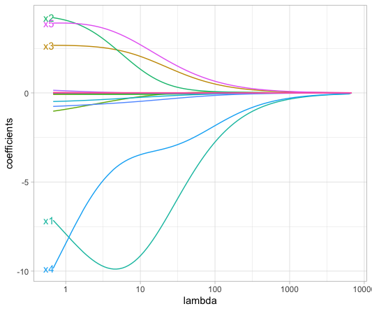

# Table of Contents
<!-- MarkdownTOC autolink="True" levels="1,2" -->

- [1. Introduction](#1-introduction)
- [2. Linear Regression](#2-linear-regression)
  - [2.1 Introduction](#21-introduction)
  - [2.3 Practice time](#23-practice-time)
  - [2.4 Simple linear regression](#24-simple-linear-regression)
  - [2.5 Multiple linear regression](#25-multiple-linear-regression)
  - [2.4 Increasingly complex linear models](#24-increasingly-complex-linear-models)
  - [2.5 Model performance](#25-model-performance)
  - [2.5 Diagnostic plots](#25-diagnostic-plots)
  - [2.6 Making predictions](#26-making-predictions)
- [3. Regularised Linear Regression](#3-regularised-linear-regression)
  - [3.1 The high-dimensionality curse of omic datasets](#31-the-high-dimensionality-curse-of-omic-datasets)
  - [3.1 Ridge regression](#31-ridge-regression)
  - [3.2 LASSO regression](#32-lasso-regression)
- [8. References](#8-references)
  - [8.1 Online books and tutorials](#81-online-books-and-tutorials)
  - [8.2 Publications and books](#82-publications-and-books)

<!-- /MarkdownTOC -->

# 1. Introduction

independent variable / explanatory variables
dependent variable / response variable

# 2. Linear Regression

## 2.1 Introduction 

Please read the [simple linear regression section](https://bradleyboehmke.github.io/HOML/linear-regression.html#simple-linear-regression) and the [multiple linear regression](https://bradleyboehmke.github.io/HOML/linear-regression.html#multi-lm) sections in [Bradley Boehmke "Hands-On Machine Learning with R" online book](https://bradleyboehmke.github.io/HOML/). 

## 2.3 Practice time
We first import the filtered set of CpGs together with their corresponding sample age. 
~~~
df <- read.delim("data/differential_cpgs.tsv",
                 header = TRUE, 
                 na.strings = "NA", 
                 stringsAsFactors = FALSE)

df[1:5,1:5]
~~~
{: .language-r}

~~~
     sample cg00059225 cg00083937 cg00090147 cg00107187
1 GSM712302  0.3232136  0.5869906 0.09335900  0.1037067
2 GSM712303  0.3615708  0.6123627 0.09505562  0.1221018
3 GSM712306  0.3496574  0.6120899 0.07671635  0.1164470
4 GSM712307  0.3515448  0.5070260 0.08565685  0.1133794
5 GSM712308  0.4328789  0.7512166 0.10236340  0.1568705
~~~
{: .output}

To perform simple and multiple linear regression with the `lm()` function, we need to reshape our dataframe like this:

| sample  | cg00000292 | cg000002426 | ...| age |
|---------|------------|-------------|----|-----|
|GSM712303|0.234       |0.987        |... |40   |
|GSM712435|0.435       |0.431        |... |34   |
|GSM712467|0.879       |0.653        |....|43   |

So our dataset seems ok for this except that we need to add back the `age` column.

Let's do this. 
~~~
sample_age <- read.delim("data/cpg_methylation_sample_age.tsv",header = TRUE, stringsAsFactors = FALSE) %>% 
  tibble() %>% 
  dplyr::select(sample, age)

df_for_regression = inner_join(df, sample_age, by  = "sample") %>% 
  column_to_rownames("sample")

df_for_regression[1:5,1:5]
~~~
{: .language-r}

~~~
           cg00059225 cg00083937 cg00090147 cg00107187 cg00201234
GSM712302  0.3232136  0.5869906 0.09335900  0.1037067  0.2174944
GSM712303  0.3615708  0.6123627 0.09505562  0.1221018  0.2335122
GSM712306  0.3496574  0.6120899 0.07671635  0.1164470  0.1947114
GSM712307  0.3515448  0.5070260 0.08565685  0.1133794  0.2134151
GSM712308  0.4328789  0.7512166 0.10236340  0.1568705  0.3491383
~~~
{: .output}

Check the dimension of the `df_for_regression` dataframe. You should have 66 rows (samples) and 229 columns: 228 CpG sites and the age Y variable.

## 2.4 Simple linear regression

We are going to create two simple models. The first one is a pure single regression analysis. 

$$Y = \beta_{0} + \beta_{1}X_{1} + \epsilon$$

with $$Y$$ being `age` here.

Let's pick one CpG site randomly as our unique $$X_{1}$$ variable.  
~~~
model1 <- lm(formula = age ~ cg00059225, data = df_for_regression)       
~~~
{: .language-r}

~~~
> summary(model1)

Call:
lm(formula = age ~ cg00059225, data = df_for_regression)

Residuals:
    Min      1Q  Median      3Q     Max 
-13.453  -5.641  -1.556   5.421  17.376 

Coefficients:
            Estimate Std. Error t value Pr(>|t|)    
(Intercept)   -5.779      6.582  -0.878    0.383    
cg00059225   126.320     20.234   6.243 3.88e-08 ***
---
Signif. codes:  0 ‘***’ 0.001 ‘**’ 0.01 ‘*’ 0.05 ‘.’ 0.1 ‘ ’ 1

Residual standard error: 7.044 on 64 degrees of freedom
Multiple R-squared:  0.3785,  Adjusted R-squared:  0.3688 
F-statistic: 38.97 on 1 and 64 DF,  p-value: 3.875e-08
~~~
{: .output}

> ## Question
> Can you interpret the meaning of the estimate for cg00059225 in plain English? Recall the [simple linear regression section](https://bradleyboehmke.github.io/HOML/linear-regression.html#simple-linear-regression) to help you out. 
{: .challenge}

## 2.5 Multiple linear regression

2 variables
~~~
model2 <- lm(formula = age ~ cg00059225 + cg00083937, data = df_for_regression)
~~~
{: .language-r}

## 2.4 Increasingly complex linear models

~~~
#66 samples so < 229
df_for_regression_subset <- df_for_regression[,c(1:50,229)] # 50 variables and the age Y

model50 <- lm(formula = age ~ ., data = df_for_regression_subset)
broom::tidy(model1)  
broom::tidy(model2)  
broom::tidy(model50)  

# More variables than samples: infinite number of best OLS fits
model_impossible <- lm(formula = age ~ ., data = df_for_regression)
broom::tidy(model_impossible)  
~~~
{: .language-r}

## 2.5 Model performance

Under the usual assumptions stated above, an unbiased estimate of the error variance is given as the sum of the squared residuals divided by $$n − p$$ (where $$p$$
is the number of variables in the model):

$$\widehat{σ}^2 = \frac{1}{n−p} \sum_{i=1}^{n} r_i^2$$  

where 

$$r_{i} = (Y_{i} - Y_{i})$$

$$r_{i}$$ is referred to as the _ith_ residual (i.e., the difference between the _ith_ observed and predicted response value). The quantity $$\widehat{\sigma}^{2}$$
is also referred to as the mean square error (MSE) and its square root is denoted __RMSE for Squared Root Mean Squared Error__. In R, the RMSE of a linear model can be extracted using the `sigma()` function.

It is also called the residual sum of squares. In R, the `summary(fitted_regression_model)` will indicate this as the `Residual standard error`.

$$\min(SSE = \sum_{i=1}^{n} (y_{i} - \widehat{y_{i}}))$$

## 2.5 Diagnostic plots
Residuals
Systematic errors versus no pattern/systematic pattern
Gain curve?

## 2.6 Making predictions

# 3. Regularised Linear Regression

## 3.1 The high-dimensionality curse of omic datasets

There are at least three reasons why "omics" limit linear regression approaches: 
- __Linear relationship:__ "off/on" switch when a gene expression or CpG methylation reaches a certain level.  
- __There are more observations (n) than features (p) ($$n > p$$):__ very often not true since "omics" will measure thousands of variables (genes, CpG sites) at the same time.
- __No or little multicollinearity:__ often not true since genes are co-regulated and methylation sites can be part of the same DNA region. 

Taken from Bradley Boehmke "Hands-On Machine Learning with R" book section on [regularised regressions](https://bradleyboehmke.github.io/HOML/regularized-regression.html): 	 
> Many real-life data sets, like those common to text mining and genomic studies are wide, meaning they contain a larger number of features ($$p > n$$). As $$p$$ increases, we’re more likely to violate some of the OLS [Ordinary Least Squares] assumptions and alternative approaches should be considered. [...] Having a large number of features invites additional issues in using classic regression models. For one, having a large number of features makes the model much less interpretable. Additionally, when $$p > n$$, there are many (in fact infinite) solutions to the OLS problem! 

This is our case as our dataset originally comprised 22,758 CpG sites (features) on _only_ 66 samples (observations). Even after we filtered for non-differential CpG sites in relation to age, we are still left with 228 CpG sites which is more than 66 (but much closer).

What we should do in this case is called __feature selection__ that will select a set of features (here CpG sites) from a bigger ensemble assuming that only this small set plays an actual role in the studied phenomenon (age here).

To quote Bradley Boehmke again: 
> In such cases, __it is useful (and practical) to assume that a smaller subset of the features exhibit the strongest effects__ (something called the bet on sparsity principle[...]. For this reason, we sometimes prefer estimation techniques that incorporate __feature selection__. One approach to this is called hard thresholding feature selection, which includes many of the traditional linear model selection approaches like forward selection and backward elimination. These procedures, however, can be computationally inefficient, do not scale well, and treat a feature as either in or out of the model (hence the name hard thresholding). In contrast, a more modern approach, called soft thresholding, slowly pushes the effects of irrelevant features toward zero, and in some cases, will zero out entire coefficients. As will be demonstrated, this can result in more accurate models that are also easier to interpret.
{: .quotation}

$$\min(SSE = \sum_{i=1}^{n} (y_{i} - \widehat{y_{i}}) + P)$$

where $$P$$ is a penalty parameter. 

There are three common penalty parameters we can implement:
- Ridge.
- LASSO.
- Elastic net (or ENET), which is a combination of ridge and lasso.

## 3.1 Ridge regression

:construction_worker:

Section under construction

:construction_worker: 

## 3.2 LASSO regression

The LASSO (least absolute shrinkage and selection operator) penalty (Tibshirani 1996) is a true feature selection method since some variable coefficients will be "pushed" to zero thereby eliminating them from the model.

Mathematically: 

$$\min(SSE + \lambda \sum_{j=1}^j \vert\beta_{j}\vert)$$

The $$\lambda$$ is called the _tuning parameter_ and determines how strong the penalty will affect the coefficient estimates.  
The $$\vert\beta_{j}\vert$$ term increases the penalty term every time a coefficient is added to the model. 

Here is an illustration (Figure 6.3) based on a LASSO regression from housing data:

<figure>
  
  <figcaption>Coefficients gradually decrease to 0 when lambda increases</figcaption>
</figure> 

~~~
cpgs <- df_for_regression %>% 
  dplyr::select(- age) %>%       # will be placed in another R object 
  as.matrix() %>%                # for glmnet function to work properly, needs a matrix data structure 
  na.omit()                      # remove NA values (glmnet has no tolerance for missing values) 

age <- df_for_regression %>% 
  na.omit() %>% 
  dplyr::pull(var = age)

my_lasso <- glmnet::glmnet(x = cpgs, 
                           y = age, 
                           standardize = FALSE,  # since all our values are between 0 and 1. No scale issue.
                           alpha = 1,            # alpha = 1 performs a LASSO analysis. 0 performs a Ridge analysis.  
                           family = "gaussian")

my_lambda_lasso_cv <- glmnet::cv.glmnet(
  x = cpgs, 
  y = age, 
  alpha = 1,
  nfolds = 10, 
  lambda = NULL, 
  type.measure = "mse")
plot(lambda_lasso, main = "Lasso penalty choice\n\n")
~~~
{: .language-r}
# 8. References

## 8.1 Online books and tutorials
- Bradley Boehmke Hands-on Machine Learning with R book sections on regressions:
  - [Linear regression](https://bradleyboehmke.github.io/HOML/linear-regression.html)
  - [Regularised regression](https://bradleyboehmke.github.io/HOML/regularized-regression.html)

## 8.2 Publications and books
- LASSO regression: Hastie, T., R. Tibshirani, and M. Wainwright. 2015. Statistical Learning with Sparsity: The Lasso and Generalizations. Chapman & Hall/Crc Monographs on Statistics & Applied Probability. Taylor & Francis.
- Gareth James, Daniela Witten, Trevor Hastie and Robert Tibshirani. 2013. An Introduction to Statistical Learning [Link](https://faculty.marshall.usc.edu/gareth-james/ISL/)
